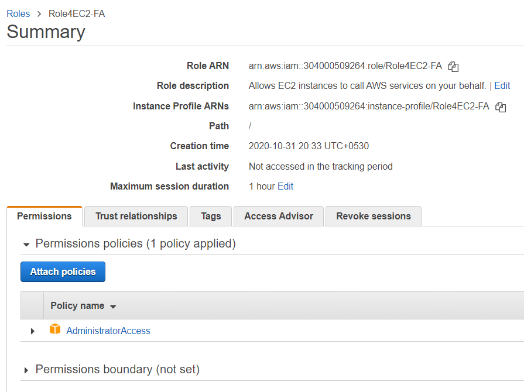
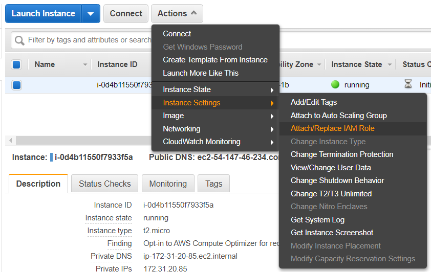

# Installing Python SDK

1. Create an Ubuntu 18.04 t2.micro EC2 instance and connect to it.

1. Execute the below commands on the EC2 instance.
    >#become root\
    >sudo su

    >#Get the list of softwares\
    >apt-get update

    >#Install Python and pip\
    >apt-get install python2.7 python-pip -y

    >#Install Python AWS SDK\
    >pip install boto3

    >#Configure the SDK\
    >exit\
    >mkdir .aws\
    >echo -e "[default]\nregion=us-east-1" > .aws/config

1. Create a Role in IAM Management Console for the with the AdministratorAccess.

1. Attach the IAM to the EC2 instance for giving the permissions to the applications on the EC2.

1. Execute the different programs in this folder and also from the below `Examples` section.

# Further Reading

1. Quick start guide
    - https://boto3.amazonaws.com/v1/documentation/api/latest/guide/quickstart.html

1. Boto3 API
    - https://boto3.amazonaws.com/v1/documentation/api/latest/reference/services/index.html

1. Examples
    - https://github.com/awsdocs/aws-doc-sdk-examples/tree/master/python/example_code
    - https://boto3.amazonaws.com/v1/documentation/api/latest/guide/examples.html
    - https://docs.aws.amazon.com/code-samples/latest/catalog/code-catalog-python.html