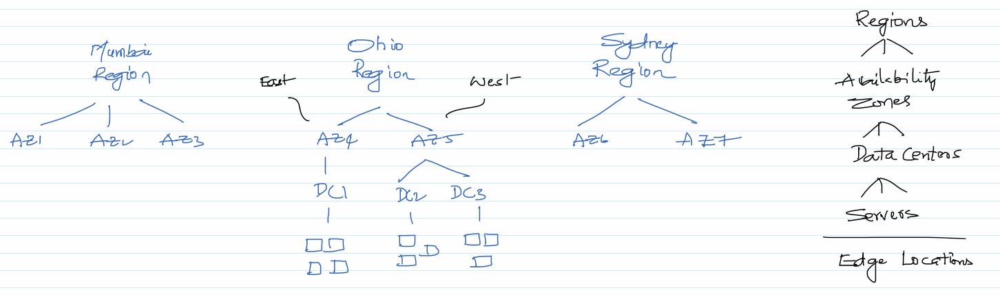
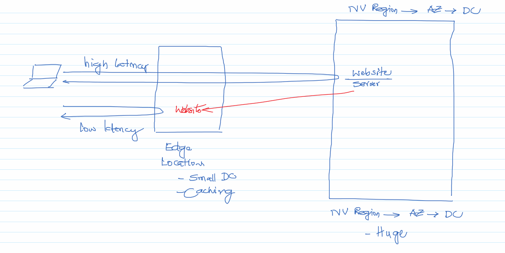

1. AWS Global Infrastructure
    - https://aws.amazon.com/about-aws/global-infrastructure/ (Regions and Availability Zones)
    - https://docs.aws.amazon.com/AWSEC2/latest/UserGuide/using-regions-availability-zones.html (has codes)
    - https://aws.amazon.com/cloudfront/features/ (Edge Locations)

1. Low-latency computing with AWS Local Zones – Part 1
    - https://aws.amazon.com/blogs/compute/low-latency-computing-with-aws-local-zones-part-1/

1. Office in India
    - https://edition.cnn.com/2019/08/22/tech/amazon-hyderabad-new-office-building/index.html

1. One percent of Googlers get to visit a data center, but I did.
    - https://blog.google/inside-google/infrastructure/how-data-center-security-works/

1. Is it on AWS? To figure if a website has been built on AWS.
    - https://isitonaws.com/

1. AWS Region in Hyderabad
    - https://aws.amazon.com/blogs/aws/in-the-works-aws-region-in-hyderabad-india/