# Integrating Lambda with AWS

A few AWS Services can be integrated with AWS Aurora Database. In this lab we will see how to integrate Lambda. As soon as a row is inserted in the Aurora table, the Lambda function is invoked which leads to sending an email via SNS.\
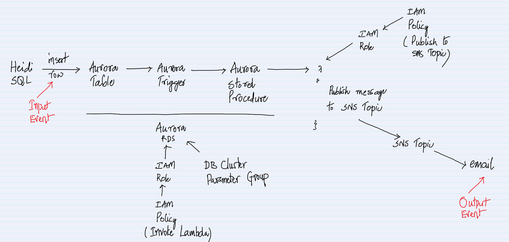

1. Create an SNS topic and subscribe to it via email.\
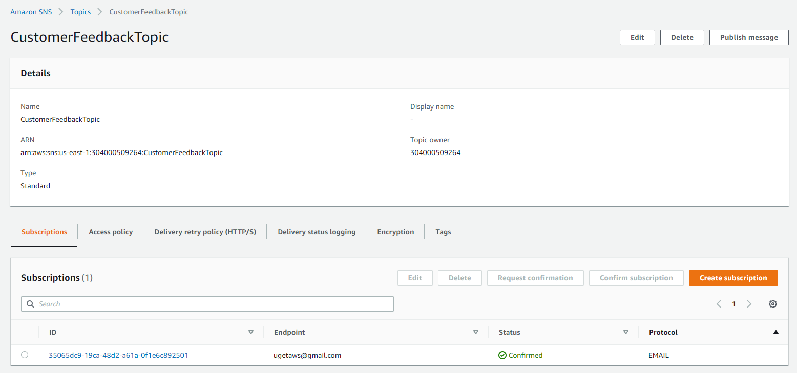

1. Create an IAM Role for the Lambda with AmazonSNSFullAccess and AWSLambdaBasicExecutionRole permissions.\
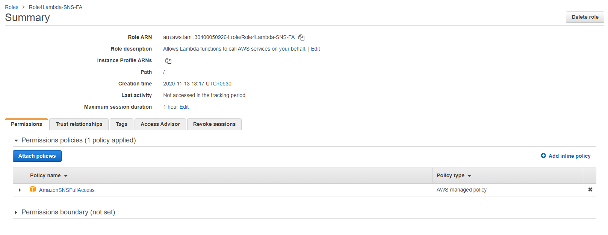

1. Create a Lambda Function with `Python 3.8` to publish a message to a topic. Make sure to replace the TopicArn in the code. Also, attach the above IAM Role to the Lambda. There is no need to add any trigger.
    ```
    import boto3

    print ("loading function")

    sns = boto3.client('sns')

    def lambda_handler(event, context):

        return sns.publish(
            TopicArn='arn:aws:sns:us-west-2:123456789012:Sample_Topic',
            Message=event['message'],
            Subject=event['subject'],
            MessageStructure='string'
        )
    ```

1. Create a IAM Policy to invoke the Lambda. Make sure to replace the Lambda ARN in the JSON.
    ```
    {
        "Version": "2012-10-17",
        "Statement": [
            {
                "Sid": "AllowAuroraToLambdaFunction",
                "Effect": "Allow",
                "Action": "lambda:InvokeFunction",
                "Resource": "arn:aws:lambda:us-east-1:304000509264:function:Publish2SNSLambdaFunction"
            }
        ]
    }
    ```
    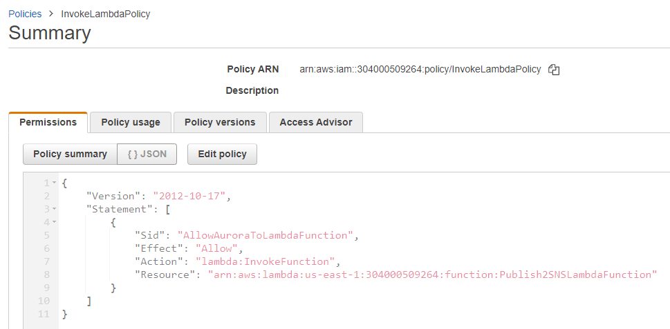

1. Create an IAM Role for RDS with the above policy. While creating the IAM Role, select `RDS - Add Role to Database` as the `use case`.\
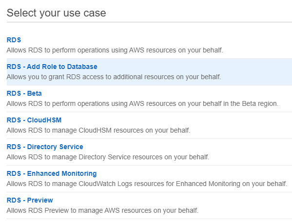
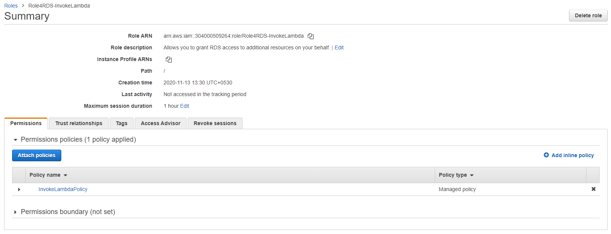

1. From the RDS Management Console, create a `DB Cluster Parameter Group`.\
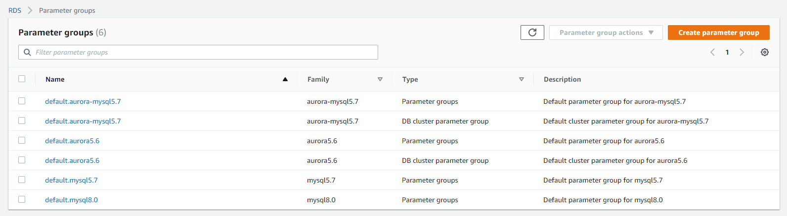
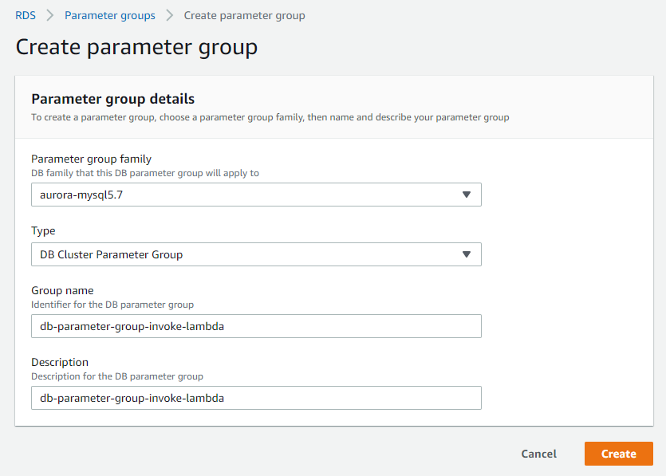

1. Select the parameter group and click on `Edit parameters`.\
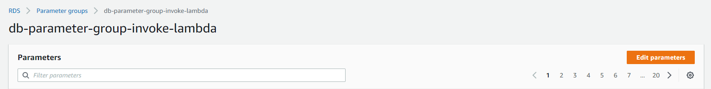

1. For the `aws_default_lambda_role` specify the IAM Role ARN created for RDS in the previous step and click on `Save changes`.\
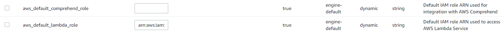

1. Download the install HeidiSQL from the below link.
    - https://www.heidisql.com/download.php

1. Create an Aurora DB with the below options. Unless specified go with the default options.
    - `Standard create` under `Choose a database creation method`.
    - `Amazon Aurora` for the `Engine options`.\
    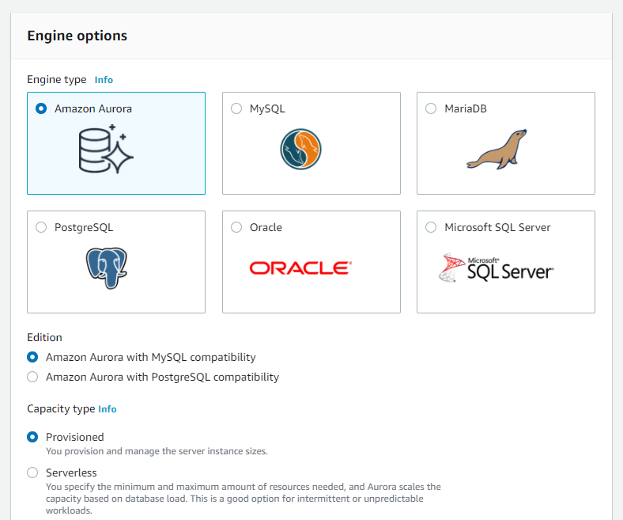
    - `Dev/Test` for the `Templates`.
    - Under the `Settings` specify the `password` twice.
    - Under the `DB instance size` select the options as shown below.\
    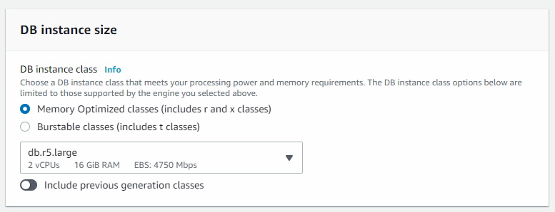
    - For the `Availability & durability` select `Don't create an Aurora Replica`.\
    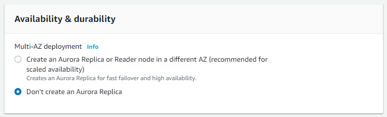
    - Under `Connectivity` for `Public access` select `Yes`.\
    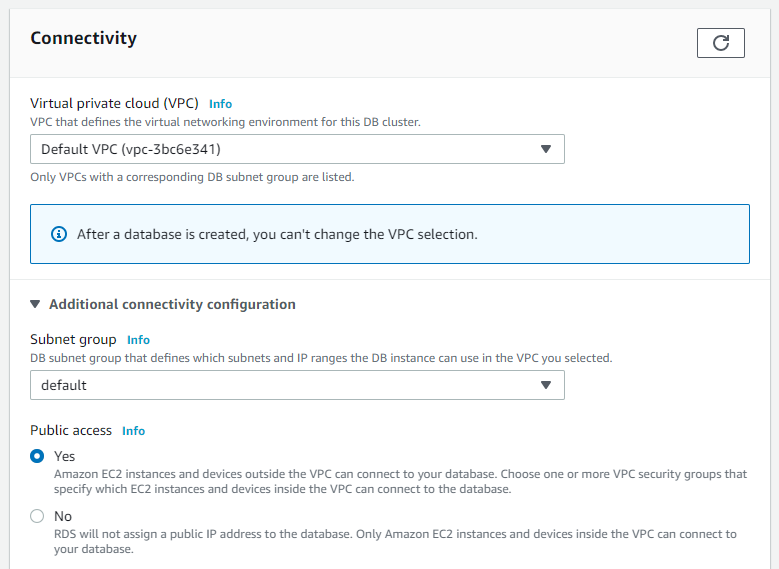
    - For Security Group select one which will allow 3306 port.
    - Under `Additional configuration` give the `Initial database name`. And for the `DB cluster parameter group`, select the one created in the previous steps.\
    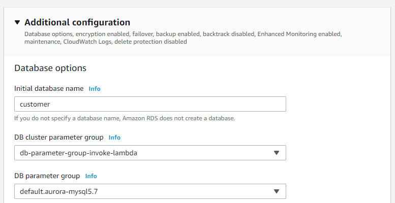
    - Finally, click on `Create database`.

1. In a few minutes the database would be created as shown below. Grab the endpoint name of the Writer.\
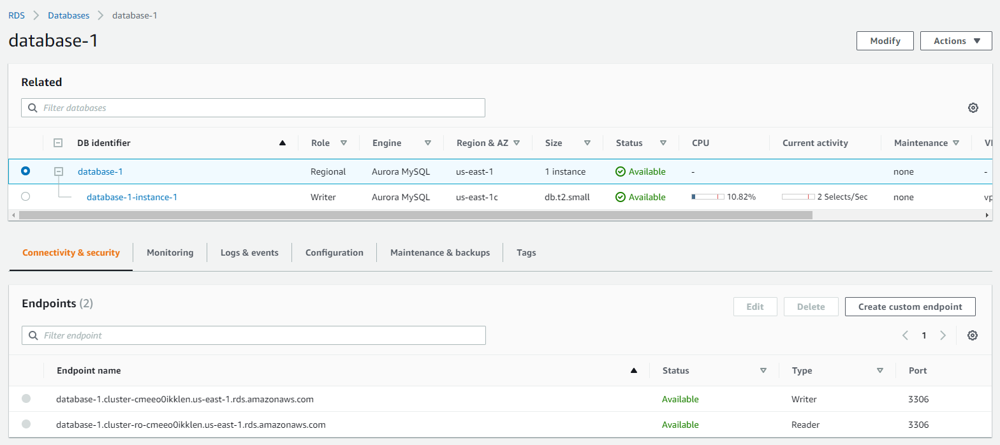

1. Give the permissions to the Aurora Cluster, attaching the IAM Role. Select the IAM Role and click on `Add role`.\
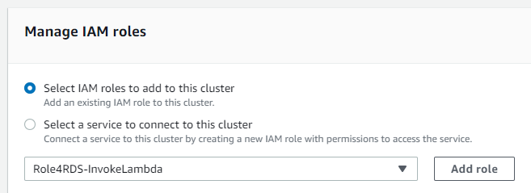

1. Connect via HeidiSQL by specifying the `Hostname / IP`, `User` and `Password`. And click on `Open`.\
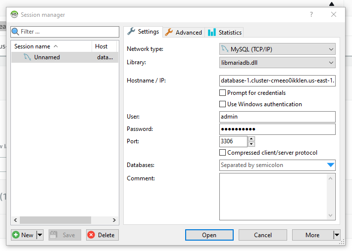

1. Create a Stored Procedure. Make sure to replace the Lambda ARN. Any warnings can be ignored.
    ```
    DROP PROCEDURE IF EXISTS SNS_Publish_Message;
    DELIMITER ;;
    CREATE PROCEDURE SNS_Publish_Message (IN subject VARCHAR(255),
                                        IN message TEXT) LANGUAGE SQL
    BEGIN
    CALL mysql.lambda_async('arn:aws:lambda:us-east-1:304000509264:function:Publish2SNSLambdaFunction',
        CONCAT('{ "subject" : "', subject,
                '", "message" : "', message, '" }')
        );
    END
    ;;
    DELIMITER ;
    ```

1. Create a Table
    ```
    CREATE TABLE Customer_Feedback (
    id int(11) NOT NULL AUTO_INCREMENT,
    customer_name varchar(255) NOT NULL,
    customer_feedback varchar(1024) NOT NULL,
    PRIMARY KEY (id)
    ) ENGINE=InnoDB DEFAULT CHARSET=utf8;
    ```

1. Create a Trigger
    ```
    DELIMITER ;;
    CREATE TRIGGER TR_Customer_Feedback_AI
    AFTER INSERT ON Customer_Feedback
    FOR EACH ROW
    BEGIN
    SELECT CONCAT('New customer feedback from ', NEW.customer_name), NEW.customer_feedback INTO @subject, @feedback;
    CALL SNS_Publish_Message(@subject, @feedback);
    END
    ;;
    DELIMITER ;
    ```

1. Insert a row into the table, which is the input event.
    ```
    insert into Customer_Feedback (customer_name, customer_feedback) VALUES ('Sample Customer', 'Good job guys!');
    ```

1. Notice the email, which is the output event.\


1. If the email is not got, check the CloudWatch logs for any error messages.