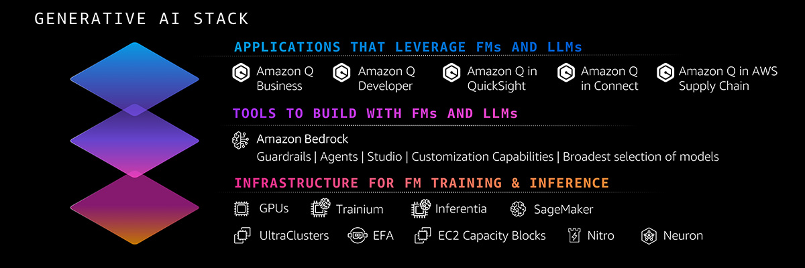

# Bedrock

## Customer Success Stories

1. Amazon Bedrock Customer Success Stories
    - https://www.youtube.com/playlist?list=PLhr1KZpdzukdxGUL7B_Gv45OG4-NECKcS

## Workshop

1. Amazon Bedrock Getting Started
    - https://explore.skillbuilder.aws/learn/course/external/view/elearning/17508/amazon-bedrock-getting-started

1. Amazon Bedrock Workshop
    - https://catalog.us-east-1.prod.workshops.aws/workshops/a4bdb007-5600-4368-81c5-ff5b4154f518/en-US

1. Building Generative AI Applications Using Amazon Bedrock
    - https://explore.skillbuilder.aws/learn/course/external/view/elearning/17904/building-generative-ai-applications-using-amazon-bedrock

## Further Reading

1. Amazon Bedrock
    - https://www.youtube.com/playlist?list=PLhr1KZpdzukfmv7jxvB0rL8SWoycA9TIM

1. Significant new capabilities make it easier to use Amazon Bedrock to build and scale generative AI applications – and achieve impressive results
    - https://aws.amazon.com/blogs/machine-learning/new-capabilities-make-it-easier-to-use-amazon-bedrock-to-build-and-scale-generative-ai-applications-and-deliver-impact/

1. Evaluating prompts at scale with Prompt Management and Prompt Flows for Amazon Bedrock
    - https://aws.amazon.com/blogs/machine-learning/evaluating-prompts-at-scale-with-prompt-management-and-prompt-flows-for-amazon-bedrock/