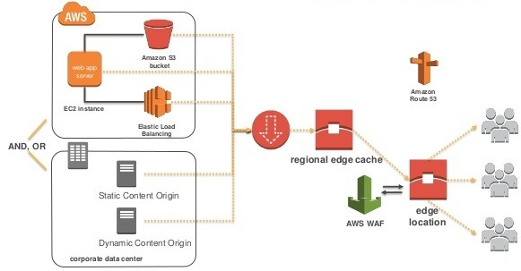

1. How CloudFront delivers content?
    - https://docs.aws.amazon.com/AmazonCloudFront/latest/DeveloperGuide/HowCloudFrontWorks.html

1. The Engineering Behind AWS CloudFront CDN
    - https://www.linkedin.com/pulse/engineering-behind-aws-cloudfront-cdn-shahnawaz-khan-/?trk=read_related_article-card_title

1. Cloudflare vs CloudFront: How They Work, Plus Which is Best For You
    - https://wp-rocket.me/blog/cloudflare-vs-cloudfront/

1. Dynamic Content Support in Amazon CloudFront
    - https://www.allthingsdistributed.com/2012/05/cloudfront-dynamic-content-support.html
    - https://blog.shikisoft.com/serving-dynamic-website-with-amazon-cloudfront/

1. Video on Demand and Live Streaming Video with CloudFront
    - https://docs.aws.amazon.com/AmazonCloudFront/latest/DeveloperGuide/on-demand-streaming-video.html

1. Choosing the price class for a CloudFront distribution
    -  https://docs.aws.amazon.com/AmazonCloudFront/latest/DeveloperGuide/PriceClass.html

1. Why is CloudFront serving outdated content from Amazon S3?
    - https://aws.amazon.com/premiumsupport/knowledge-center/cloudfront-serving-outdated-content-s3/   

1. Restricting Access to Amazon S3 Content by Using an Origin Access Identity
    - https://docs.aws.amazon.com/AmazonCloudFront/latest/DeveloperGuide/private-content-restricting-access-to-s3.html

1. Lambda@Edge
    - https://aws.amazon.com/lambda/edge/

1. Serving private content with signed URLs and signed cookies
    - https://docs.aws.amazon.com/AmazonCloudFront/latest/DeveloperGuide/PrivateContent.html