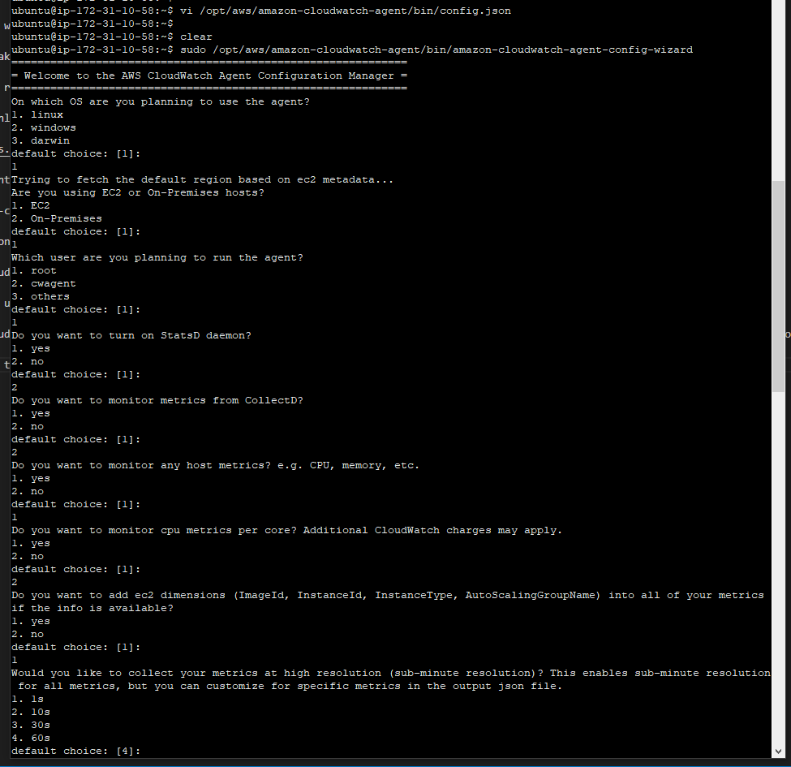
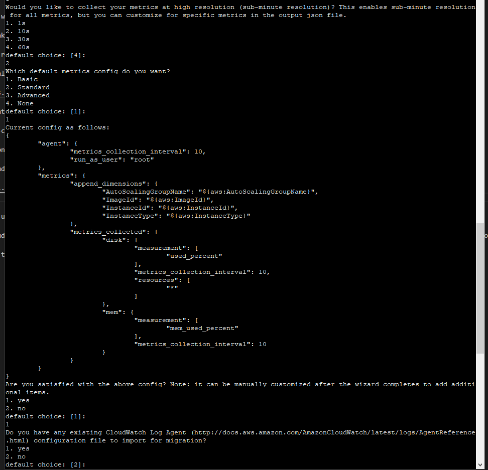
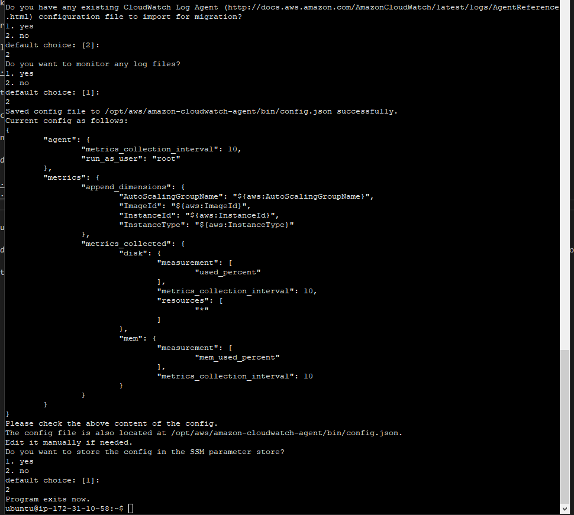
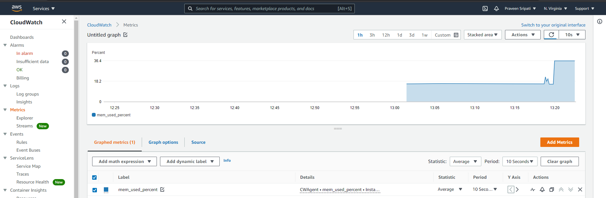

# Using the CloudWatch Agent to gather the memory metrics of an EC2 instance

1. Create an IAM Role for EC2 with the `CloudWatchAgentServerPolicy` policy.

1. Create an Ubuntu EC2 and make sure port 22 and 80 are opened.

1. Attach the earlier created role to the EC2.

1. Connect to the EC2 and download the latest CloudWatch agent using the below command.

    >wget https://s3.amazonaws.com/amazoncloudwatch-agent/debian/amd64/latest/amazon-cloudwatch-agent.deb

1. Install the CloudWatch agent using the below command.

    >sudo dpkg -i -E ./amazon-cloudwatch-agent.deb

1. Run the CloudWatch Agent Configuration Wizard. Select the different options as shown below.

    >sudo /opt/aws/amazon-cloudwatch-agent/bin/amazon-cloudwatch-agent-config-wizard

    
    
    

1. Start the CloudWatch Agent using the below command.

    >sudo /opt/aws/amazon-cloudwatch-agent/bin/amazon-cloudwatch-agent-ctl -a fetch-config -m ec2 -s -c file:/opt/aws/amazon-cloudwatch-agent/bin/config.json

1. Go to CloudWatch and watch the memory Metrics.

1. Increase the memory usage by using the below commands.

    >sudo apt-get update  
    >sudo apt-get install stress -y  
    >stress -m 1 --vm-bytes 200M --vm-keep

    

# Further Reading

1. Collecting metrics and logs from Amazon EC2 instances and on-premises servers with the CloudWatch agent
    - https://docs.aws.amazon.com/AmazonCloudWatch/latest/monitoring/Install-CloudWatch-Agent.html

1. CloudWatch agent predefined metric sets
    - https://docs.aws.amazon.com/AmazonCloudWatch/latest/monitoring/create-cloudwatch-agent-configuration-file-wizard.html