# Creating an EKS Cluster with Managed Nodes

1. Create a K8S Cluster **With Managed Nodes**. Make sure to replace the Subnet Id got from the VPC Management Console.
    >eksctl create cluster -f k8s-cluster-managed.yaml
    

1. Initially the EKS Cluster would be in a `Creating` status.\
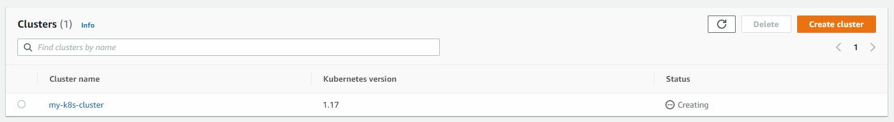

1. The progress can be monitored from the CloudFormation also.\
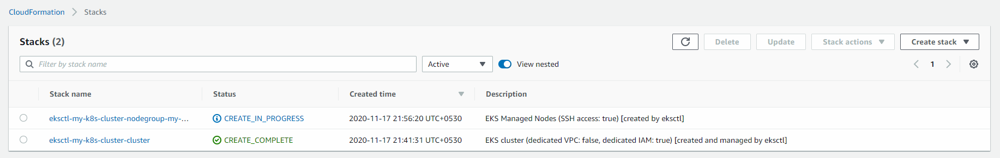

1. Finally, the Cluster be ready.\
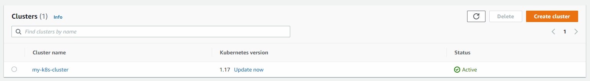

1. The same can be observed in the CloudFormation also.\
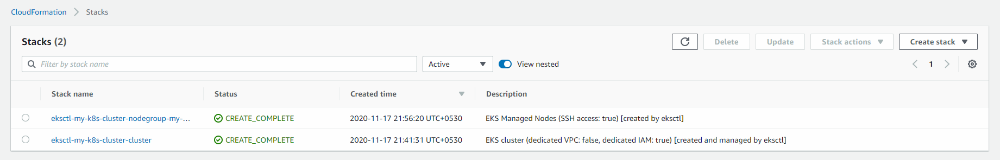

1. A worker node also would be created in the EC2.\
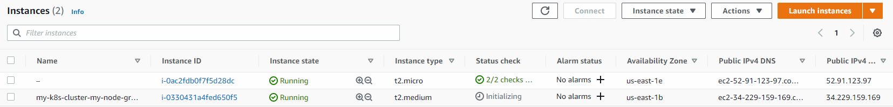

1. The `eksctl create cluster` command also should execute without any errors.\


1. Execute the below `kubectl` commands to create an nginx webpage with the default page.

    - Delete the namespace and create it again
        >kubectl delete namespace my-namespace\
        >kubectl create namespace my-namespace

    - Create a deployment and service
        >kubectl apply -f sample-service-managed-node.yaml

    - Get all the resources in the my-namespace
        >kubectl get all -n my-namespace

    - In a few minutes all the resources would be ready as shown below\
    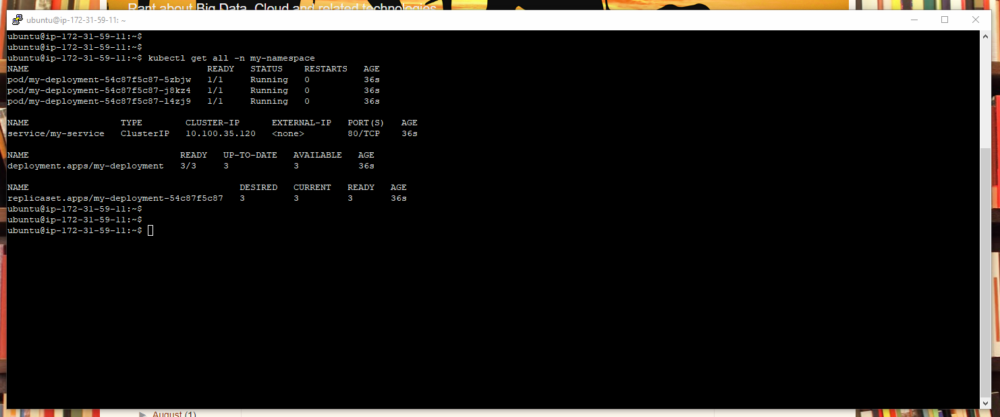

    - Get the deployments
        >kubectl -n my-namespace get deployments

    - Get the pods
        >kubectl -n my-namespace get pods

    - Delete one of the pod and a new pod would be automatically created. Make sure to replace the Pod id in the command. 
        >kubectl -n my-namespace delete pod/my-deployment-54c87f5c87-5zbjw

    - The newly created pod can be observed by looking at the `AGE` of the pod.\
    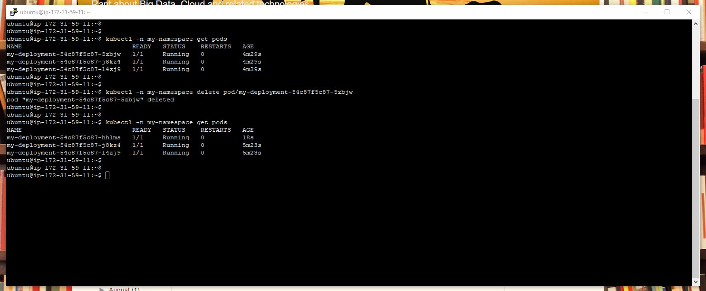

    - Get the services. The service is exposed on port 31234 on the EC2.
        >kubectl -n my-namespace get services\
    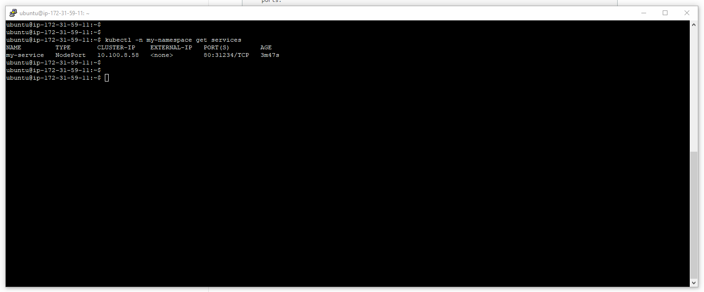

    - The default nginx website can be accessed in the browser by using the Public IP of the EC2 and port 31234.\
    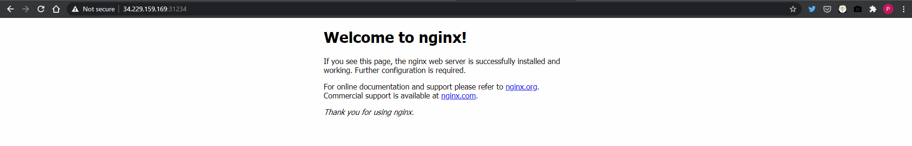

1. Create an policy with the below JSON giving the permissions to interact with ECR.
    ```
    {
        "Version": "2012-10-17",
        "Statement": [
            {
                "Effect": "Allow",
                "Action": [
                    "ecr:BatchCheckLayerAvailability",
                    "ecr:BatchGetImage",
                    "ecr:GetDownloadUrlForLayer",
                    "ecr:GetAuthorizationToken"
                ],
                "Resource": "*"
            }
        ]
    }
    ```

1. Identify the IAM Role associated with the NodeGroup -- `Node IAM Role ARN`. Modify the Role and attach above Policy.\
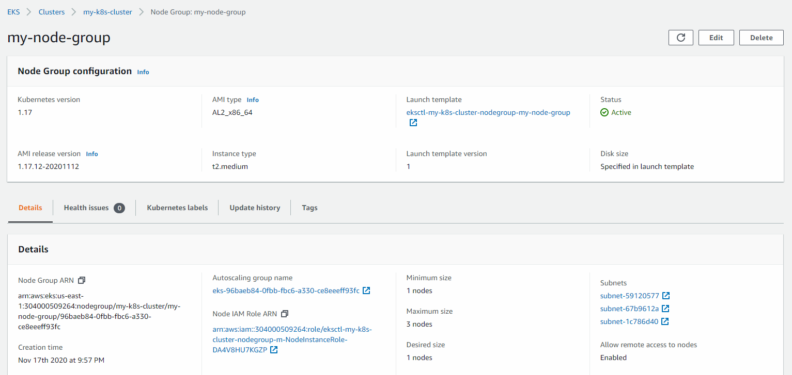

1. Navigate to the ECR Management Console and grab the `Image URI`.\
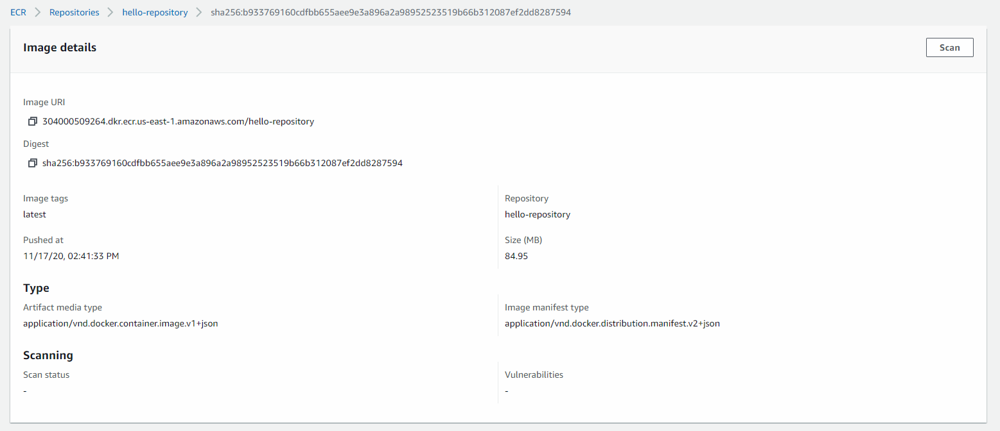

1. Push the Docker image to ECR.

    - Modify the image (line 37) nginx with the `Image-URI` got from the previous step in `sample-service-managed-node.yaml`.
    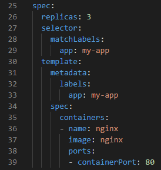

    - Create a deployment and service.
        >kubectl apply -f sample-service-managed-node.yaml

    - Describe one of the Pod. Make sure to replace the Pod id
        >kubectl -n my-namespace describe pod/my-deployment-654ffcf5c9-5b6sd

    - An event saying that the image has been downloaded successfully should be there.
    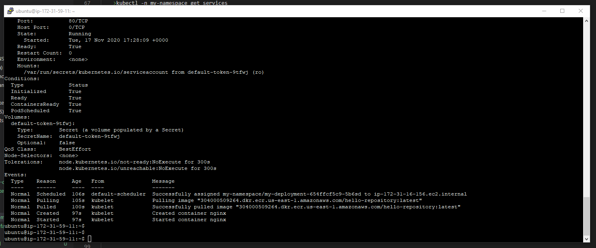

1. Detach the Policy which has been added to the IAM Role in one of the previous steps.

1. Delete the EKS Cluster.
    >eksctl delete cluster my-k8s-cluster