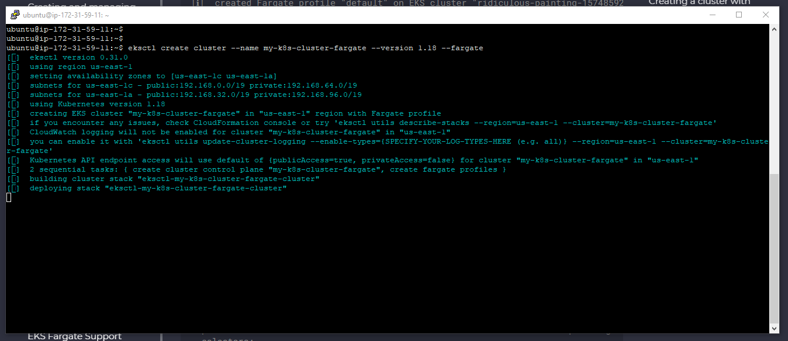
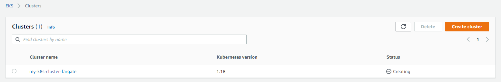
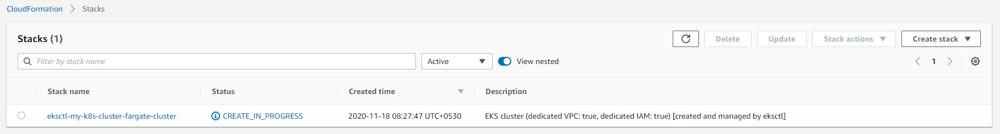
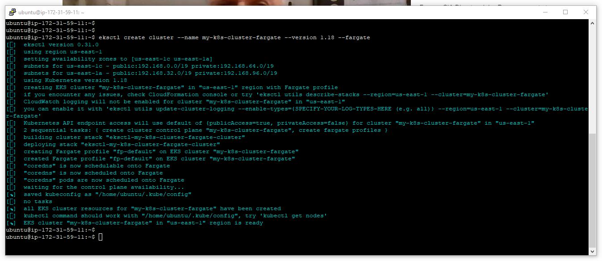
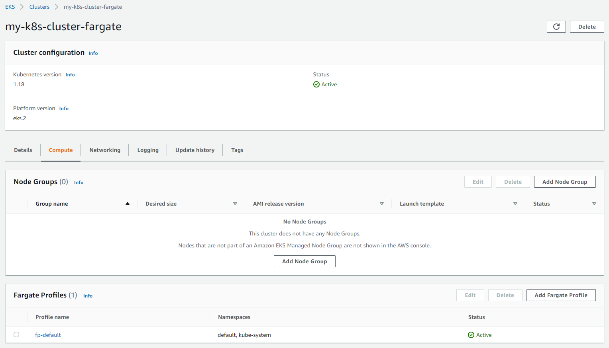
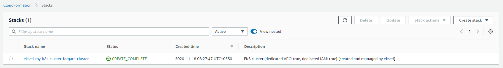
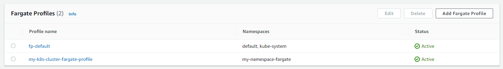
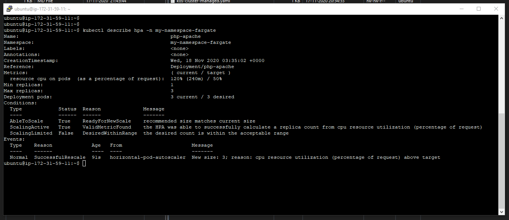
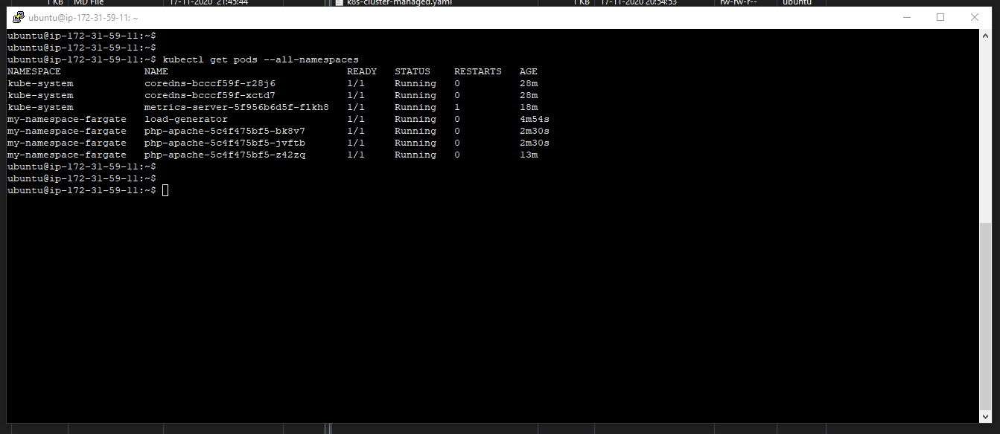

# Creating an EKS Cluster with Fargate

1. Create a EKS Fargate Cluster.
    >eksctl create cluster --name my-k8s-cluster-fargate --version 1.18 --fargate
    
    
    

1. In a few minutes the Fargate Cluster would be created as shown below.

1. Create a Fargate profile for the cluster. Anything deployed onto the `my-namespace-fargate` namespace will be automatically deployed on Fargate.
    >eksctl create fargateprofile --cluster my-k8s-cluster-fargate --name my-k8s-cluster-fargate-profile --namespace my-namespace-fargate
    

1. As more Pods get created in the subsequent steps, execute the below command to get the status of the Pods. Make sure the status is `Running` and not `Pending` before proceeding with the next step.
    >kubectl get pods --all-namespaces

1. Create a namespace defined in the Fargate profile.
    >kubectl create namespace my-namespace-fargate

1. Install the metrics server.
    >kubectl apply -f https://github.com/kubernetes-sigs/metrics-server/releases/download/v0.3.6/components.yaml  
    >kubectl get deployment metrics-server -n kube-system

1. Deploy a simple Apache web server application.
    >kubectl apply -f sample-php-apache-fargate.yaml

1. Create a Horizontal Pod Autoscaler resource for the php-apache deployment.
    >kubectl autoscale deployment php-apache --cpu-percent=50 --min=1 --max=3 -n my-namespace-fargate

1. Describe the HPA.
    >kubectl describe hpa -n my-namespace-fargate
    

1. Create load for the web server by running a container. The first command will start a busybox container, where the infinite while loop can be run.
    >kubectl run -n my-namespace-fargate -it --rm load-generator --image=busybox /bin/sh\
    >while true; do wget -q -O- http://php-apache; done

1. Describe the HPA. A new Putty session has to be opened as the previous command goes in a infinite loop. The desired pods should be 3.\
    >kubectl describe hpa -n my-namespace-fargate
    

1. Notice the additional Pods.

1. Delete the K8S Cluster.
    >eksctl delete cluster --name my-k8s-cluster-fargate