# Creating ECS Cluster using EC2

1. Navigate to the ECS Management Console and go to the `Task Definitions`. Click on `Create new Task Definition`.\

1. For the launch type compatibility select EC2. Click on `Next step`.\
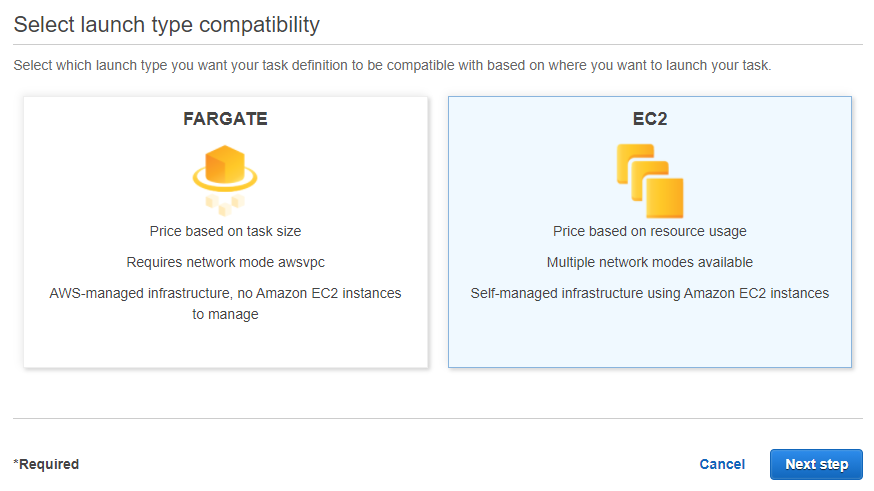

1. Navigate to the bottom of the screen and click on `Configure via JSON`.\

1. Copy the task definition from the `ecs-task-definition-ec2.json` file and paste it. Click on `Save`. Click on `Create`. Here the task definition is using an `httpd` image, but the image which has uploaded to the ECR can also be used. Check `ecs-task-definition-ec2-from-ecr.json` for more details.

1. Navigate to the `Clusters` tab and click on `Create Cluster`.\

1. For the cluster template select `EC2 Linux - Networking`. Click on `Next step`.\
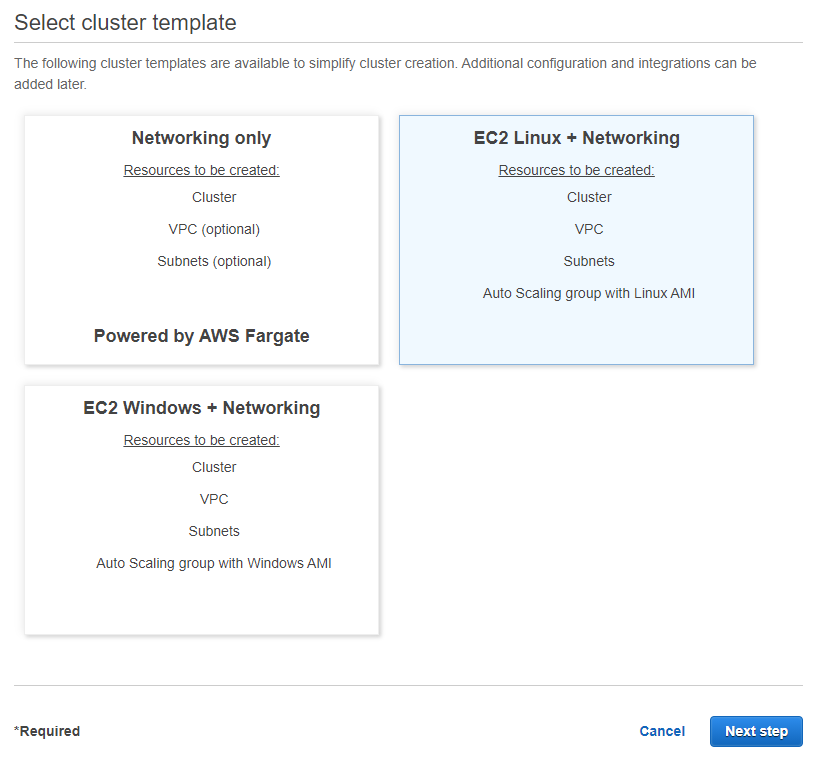

1. Specify the cluster details and finally click on `Create`.
    - Give the cluster a name `my-ecs-cluster-ec2`.
    - Select `t2.micro` for the EC2 instance type.
    - Select the `Key pair`.
    - For the Networking select the existing VPC and one of the subnet.
    - For `Auto assign public IP` select `Enabled`.
    - For the `Security group` select `AllowAll`.
    - For the `Container instance IAM role` select `Create new role`.
    - Rest of the options can be default.
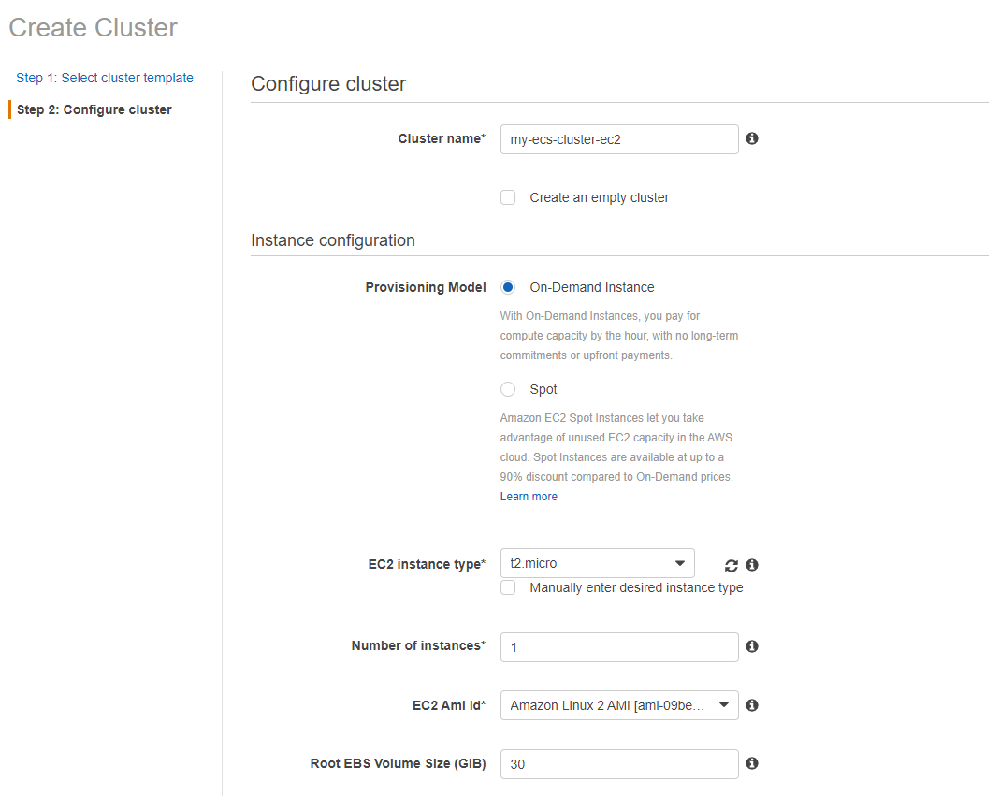
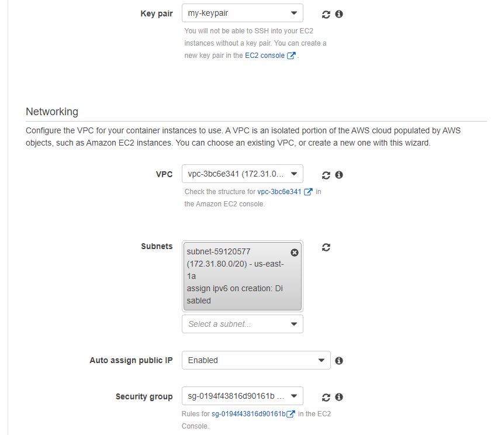
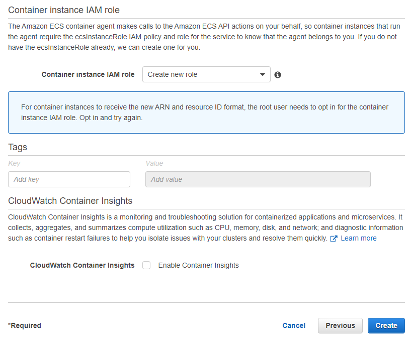

1. The ECS Cluster would be created via a CloudFormation stack in a few minutes as shown below.
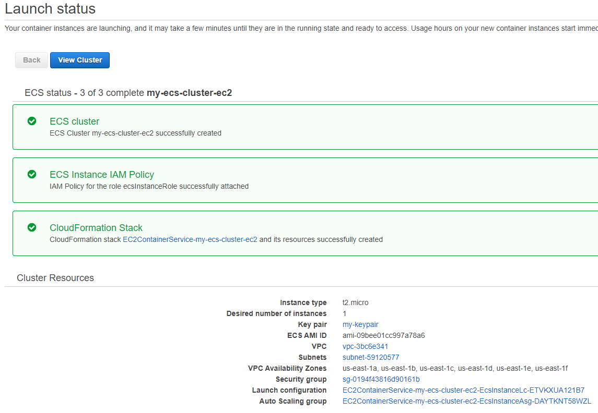
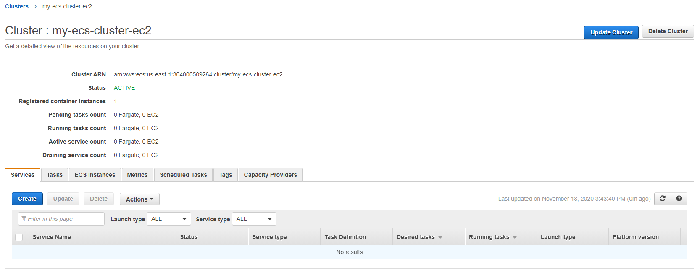
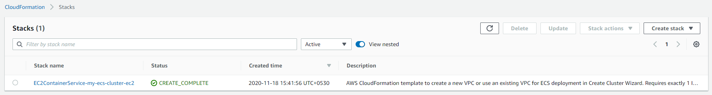
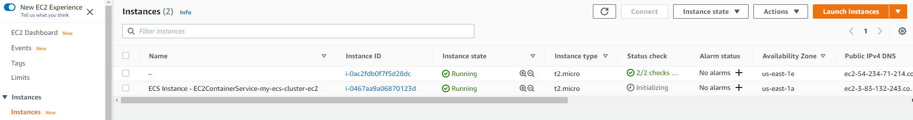

1. Under the `Services` tab click on `Create` with the below details.
    - For Launch type, select EC2
    - For Task definition, select the task definition created in previous step.
    - For Cluster, select the cluster you created in step 2.
    - For Service name, enter the name of the service `my-ecs-service`.
    - For Number of tasks, enter 1.
    - Finally click on `Next step`.

1. For the `Load balancing` screen go with the default options and click on `Next step`.

1. For the Auto Scaling, go with the default options. Click on `Next step`.

1. Review all the details and click on `Create Service`. Click on `View Service`.
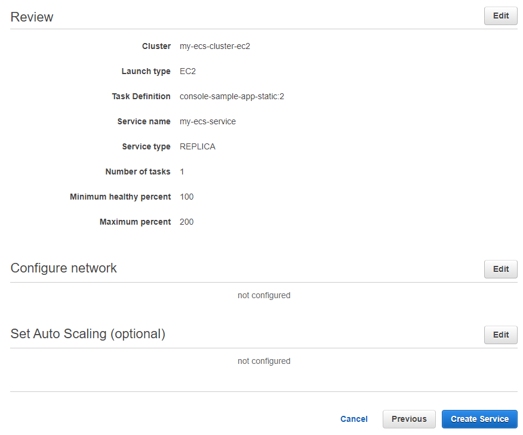

1. In a few seconds the tasks under the service would be in `RUNNING` state as shown below.
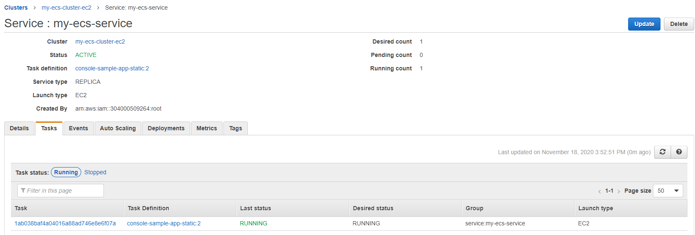

1. Click on the `Task`. Expand the Containers and get the `External Link`. Open the same in the browser to display the website in the container.
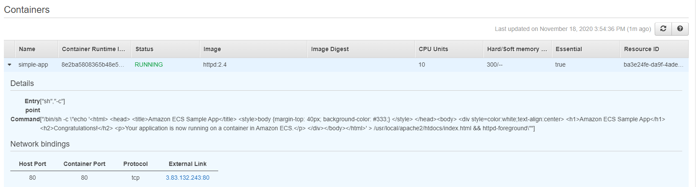
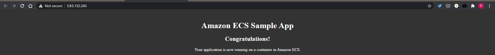

1. Select the service and delete it. And finally, delete the cluster.
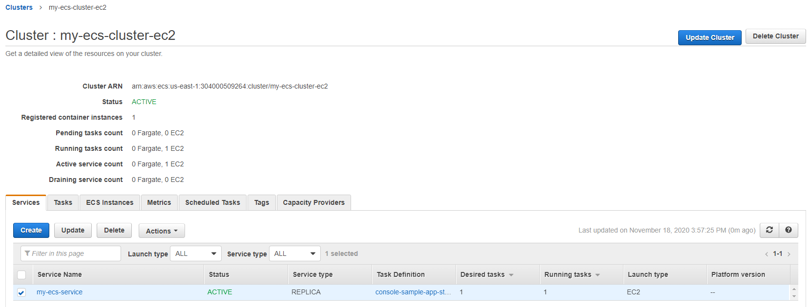
