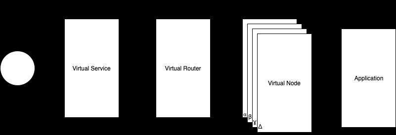

# AWS App Mesh

 `Service Mesh` is a new software layer that handles all of the communications between services. It provides new features to connect and manage connections between services and is independent of each service’s code, allowing it to work across network boundaries and with multiple service management systems. AWS App Mesh is a managed serviced provided by AWS around Service Mesh.

`AWS App Mesh` is a new technology that makes it easy to monitor, control, and debug the communications between services. App Mesh separates the logic needed for monitoring and controlling communications into a proxy that runs next to every service. This removes the need to coordinate across teams or update application code to change how monitoring data is collected or traffic is routed. This allows you to quickly pinpoint the exact location of errors and automatically reroute network traffic when there are failures or when code changes need to be deployed.

Envoy proxy has to be added to the Amazon ECS task, Kubernetes pod, or Amazon EC2 instance represented by your App Mesh endpoint, such as a virtual node or virtual gateway. 

Consider the following simple example application, that doesn’t use App Mesh. The two services can be running on AWS Fargate, Amazon Elastic Container Service (Amazon ECS), Amazon Elastic Kubernetes Service (Amazon EKS), Kubernetes on Amazon Elastic Compute Cloud (Amazon EC2) instances, or on Amazon EC2 instances with Docker.

In this illustration, both serviceA and serviceB are discoverable through the apps.local namespace. Let's say, for example, you decide to deploy a new version of serviceb.apps.local named servicebv2.apps.local. Next, you want to direct a percentage of the traffic from servicea.apps.local to serviceb.apps.local and a percentage to servicebv2.apps.local. When you're sure that servicebv2 is performing well, you want to send 100 percent of the traffic to it.

App Mesh can help you do this without changing any application code or registered service names. If you use App Mesh with this example application, then your mesh might look like the following illustration.

App Mesh benefits (https://www.appmeshworkshop.com/introduction/appmesh_benefits/)\
    - End-to-end visibility\
    - Ensure high availability\
    - Streamline operations\
    - Enhance any application\
    - End-to-end Encryption

# Further Reading

1. What Is AWS App Mesh?
    - https://docs.aws.amazon.com/app-mesh/latest/userguide/what-is-app-mesh.html

1. AWS App Mesh Examples
    - https://github.com/aws/aws-app-mesh-examples

1. Getting started with App Mesh
    - https://docs.aws.amazon.com/app-mesh/latest/userguide/getting-started.html

1. App Mesh Workshop
    - https://www.appmeshworkshop.com/