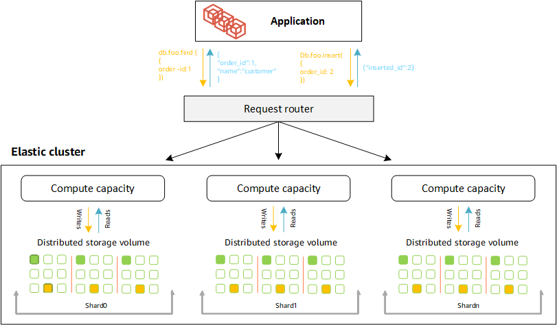

# DocumentDB

In Amazon DocumentDB, storage scales automatically up to 128 TiB in **Instance-based Clusters**, and 4 PiB in Amazon DocumentDB **Elastic Clusters**, with little to no impact to your application. Amazon DocumentDB supports millions of requests per second with up to 15 low latency read replicas in minutes, without any application downtime, regardless of the size of your data.

Amazon DocumentDB offers 99.9% SLA and makes your data durable across three Availability Zones (AZs) within a Region by replicating new writes six ways to ensure your data remains readable in the rare occurrence of a full AZ failure plus an additional concurrent storage node failure in a different AZ. By replicating new writes six ways, Amazon DocumentDB is resilient to failures and ensures zero data loss failovers within a Region. Customers only pay for one copy of storage.

Amazon DocumentDB elastic cluster sharding
https://docs.aws.amazon.com/documentdb/latest/developerguide/elastic-how-it-works.html

## Definitions of shard nomenclature

**Shard** — A shard provides compute for an elastic cluster. A shard by default will have two nodes. You can configure a maximum of 32 shards and each shard can have a maximum of 64 vCPUs.

**Shard key** — A shard key is a required field in your JSON documents in sharded collections that elastic clusters use to distribute read and write traffic to the matching shard.

**Shard collection** — A shard collection is a collection whose data is distributed across an elastic cluster in data partitions.

**Partition** — A partition is a logical portion of sharded data. When you create a sharded collection, the data is organized into partitions within each shard automatically based on the shard key. Each shard has multiple partitions.

## SQL vs. non-relational terminology

https://docs.aws.amazon.com/documentdb/latest/developerguide/document-database-documents-understanding.html#document-database-sql-vs-nosql-terms

## Availability

https://docs.aws.amazon.com/documentdb/latest/developerguide/docdb-migration.html#docdb-migration-planning

# Further Reading

1. Supported MongoDB APIs, operations, and data types in Amazon DocumentDB
    - https://docs.aws.amazon.com/documentdb/latest/developerguide/mongo-apis.html

1. Connecting to Amazon DocumentDB as a replica set
    - https://docs.aws.amazon.com/documentdb/latest/developerguide/connect-to-replica-set.html

1. Connecting and developing applications with Amazon DocumentDB
    - https://docs.aws.amazon.com/documentdb/latest/developerguide/documentdb-development.html

1. Performing text search with Amazon DocumentDB
    - https://docs.aws.amazon.com/documentdb/latest/developerguide/text-search.html