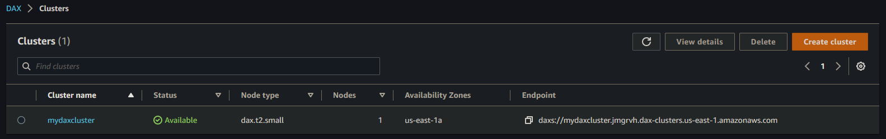
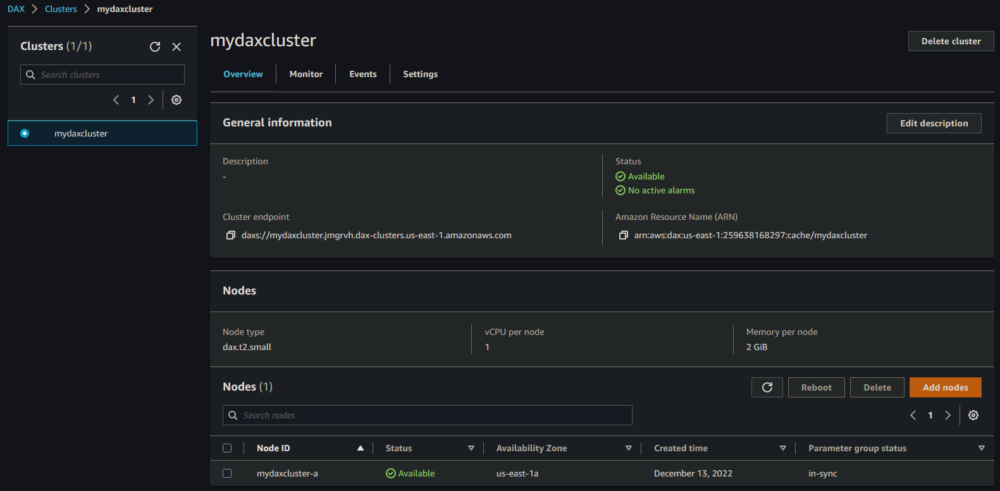
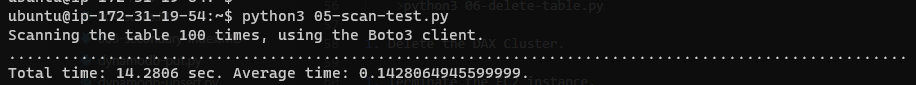
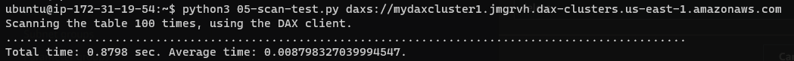

# Getting started with DynamoDB DAX

Amazon DynamoDB is designed for scale and performance. In most cases, the DynamoDB response times can be measured in single-digit milliseconds. However, there are certain use cases that require response times in microseconds. For these use cases, DynamoDB Accelerator (DAX) delivers fast response times for accessing eventually consistent data.

1. Setup a DAX Cluster.
    - Give the Cluster a name `MyDAXCluster`.
    - For the `Node families` select `t-type family` and select `dax.t2.small`
    - Select the `Number of nodes` as 1. (not OK for Prod)
    - Click `Next`.

    - Create a new `subnet group`.
    - Give a name for the `subnet group` as `DAXSubnetGroup`.
    - Go with the default `VPC` and select a `subnet`.
    - Choose the default `Security Group`.
    - For the `Availability Zones (AZ)` select `Automatic`.
    - Click `Next`.

    - For the `IAM Permissions` select `Create new` and give a name `DAXtoDynamoDBRole`.
    - Select `Create policy` with `Read/write` and give a name `DAXFullAccess-DAXtoDynamoDBRole`.
    - For the `Access to DynamoDB tables` select `All tables`.
    - Click `Next`.

    - Click `Next` with the default options in the `Verify advanced settings`.

    - Review all the details and click on `Create cluster`.

1. The Cluster will be in `Available` Status in a few minutes.

1. Note down the `Cluster endpoint`.

1. Create an Ubuntu EC2, install Python3, Pip3. Create an IAM Role and attach to the EC2. Instructions [here](https://github.com/praveensripati/learn-aws/tree/main/AWS-Interfaces/python-interface).

1. Install Amazon DAX Client` for Python.
    >sudo pip3 install amazon-dax-client

1. Create table and put data.
    >python3 01-create-table.py  
    >python3 02-write-data.py

1. Run the following Python programs. Take note of the timing information—the number of milliseconds required for the Scan test.
    >python3 scan-test.py

    
1. Get the endpoint of the DAX Cluster.
    >aws dax describe-clusters --query "Clusters[*].ClusterDiscoveryEndpoint"

1. Run the program again, but this time, specify the cluster endpoint as a command line parameter.
    >python3 scan-test.py dax://my-cluster.l6fzcv.dax-clusters.us-east-1.amazonaws.com

    

1. Run the following Python program to delete TryDaxTable.
    >python3 delete-table.py

1. Delete the DAX Cluster.

1. Terminate the EC2 instance.

# Further Reading

1. In-memory acceleration with DynamoDB Accelerator (DAX)
    - https://docs.aws.amazon.com/amazondynamodb/latest/developerguide/DAX.html