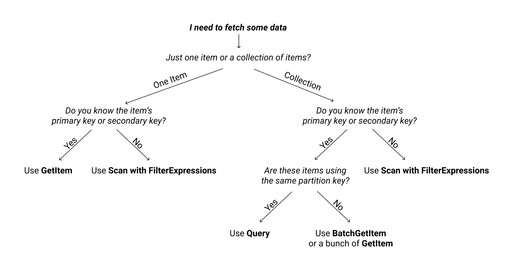

# DynamoDB (NoSQL)

# Further Reading

1. DynamoDB Guide
    - https://www.dynamodbguide.com/what-is-dynamo-db

1. DynamoDB Paper
    - https://www.usenix.org/system/files/atc22-elhemali.pdf
    - https://brooker.co.za/blog/2022/07/12/dynamodb.html
    - https://www.alexdebrie.com/posts/dynamodb-paper/

1. Amazon Prime Day Infrastructure (including DynamoDB)
    - https://aws.amazon.com/blogs/aws/how-aws-powered-prime-day-2024-for-record-breaking-sales/

1. Migration Complete
    - https://aws.amazon.com/blogs/aws/migration-complete-amazons-consumer-business-just-turned-off-its-final-oracle-database/

1. DynamoDB Scan vs Query - Everything You Need To Know
    - https://dynobase.dev/dynamodb-scan-vs-query/

    

1. How to know if DynamoDB is appropriate?
    - https://aws.amazon.com/blogs/database/how-to-determine-if-amazon-dynamodb-is-appropriate-for-your-needs-and-then-plan-your-migration/

1. The five most visited Amazon DynamoDB blog posts of 2022
    - https://aws.amazon.com/blogs/database/the-five-most-visited-amazon-dynamodb-blog-posts-of-2022/

1. DynamoDB Core Components?
    - https://docs.aws.amazon.com/amazondynamodb/latest/developerguide/HowItWorks.CoreComponents.html

1. Storing JSON documents in Amazon DynamoDB tables
    - https://aws.amazon.com/blogs/developer/storing-json-documents-in-amazon-dynamodb-tables/

1. Best Practices for DynamoDB
    - https://docs.aws.amazon.com/amazondynamodb/latest/developerguide/best-practices.html

1. Fine-Grained access Control
    - https://aws.amazon.com/blogs/aws/fine-grained-access-control-for-amazon-dynamodb/

1. Write Consistency (Eventual and Strong)
    - https://docs.aws.amazon.com/amazondynamodb/latest/developerguide/HowItWorks.ReadConsistency.html

1. How to auto increment in DynamoDB?
    - https://stackoverflow.com/a/45899308/614157
    - https://martinstapel.com/how-to-autoincrement-in-dynamo-db-if-you-really-need-to/
    - https://docs.aws.amazon.com/amazondynamodb/latest/developerguide/WorkingWithItems.html#WorkingWithItems.ConditionalUpdate

1. Single-table vs. multi-table design in Amazon DynamoDB
    - https://aws.amazon.com/blogs/database/single-table-vs-multi-table-design-in-amazon-dynamodb/

# Backup and Restore

1. On-Demand Backup and Restore for DynamoDB
    - https://docs.aws.amazon.com/amazondynamodb/latest/developerguide/BackupRestore.html

1. Point-in-Time Recovery: How It Works
    - https://docs.aws.amazon.com/amazondynamodb/latest/developerguide/PointInTimeRecovery.html

# Interfaces

1. Operations allowed on DynamoDB
    - https://docs.aws.amazon.com/amazondynamodb/latest/APIReference/API_Operations_Amazon_DynamoDB.html

1. Interacting with DynamoDB from different languages
    - https://docs.aws.amazon.com/amazondynamodb/latest/developerguide/GettingStarted.html

1. Interacting with DynamoDB from Web Console
    - https://aws.amazon.com/getting-started/tutorials/create-nosql-table/

1. Setting up DynamoDB Locally
    - http://docs.aws.amazon.com/amazondynamodb/latest/developerguide/DynamoDBLocal.html

1. DynamoDB WorkBench
    - https://docs.aws.amazon.com/amazondynamodb/latest/developerguide/workbench.html

1. SQL on DynamoDB

    - https://docs.aws.amazon.com/amazondynamodb/latest/developerguide/ql-reference.html
    - https://aws.amazon.com/blogs/opensource/announcing-partiql-one-query-language-for-all-your-data/

    - https://github.com/fsprojects/DynamoDb.SQL
    - https://www.simba.com/products/DynamoDB/doc/ODBC_InstallGuide/win/content/odbc/dy/features/sqlinterface.htm
    - https://www.razorsql.com/features/dynamodb_sql_editor.html

# Pricing

1. WCU and RCU Pricing
    - https://aws.amazon.com/dynamodb/pricing/provisioned/

# Use cases

1. How OLX optimized their Amazon DynamoDB costs by scaling their query patterns
    - https://aws.amazon.com/blogs/database/how-olx-optimized-their-amazon-dynamodb-costs-by-scaling-their-query-patterns/

# TODO

1. Need to categorize them.