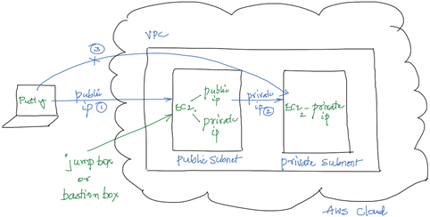
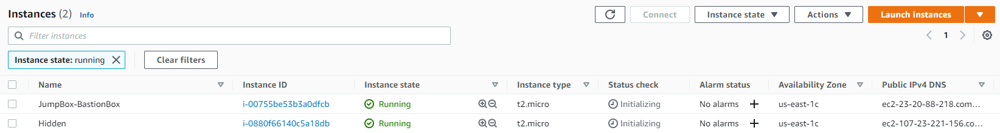
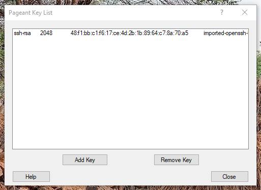
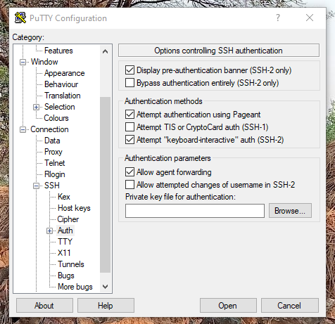
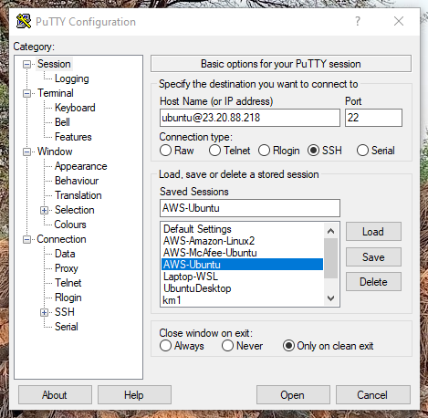
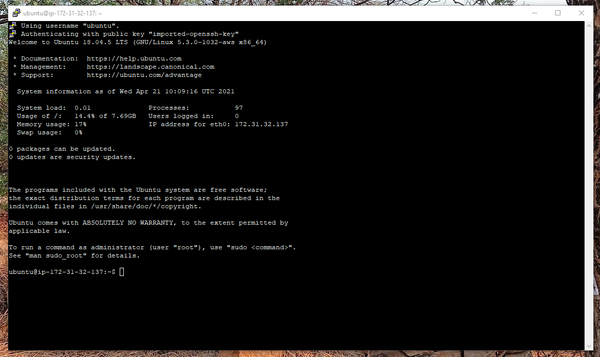
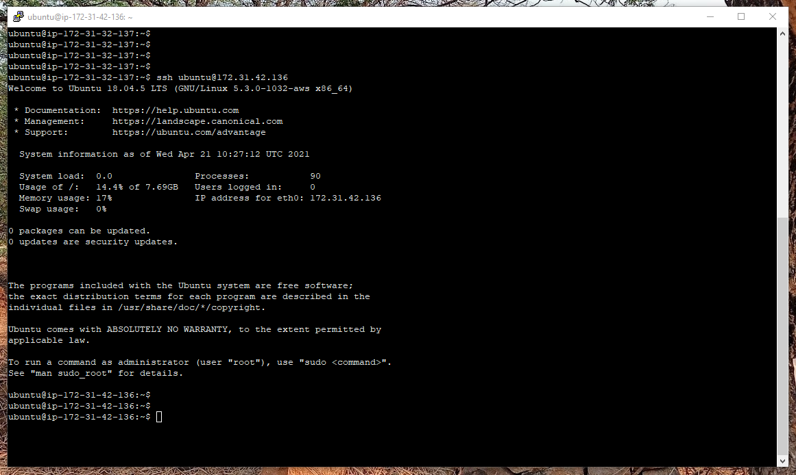

# Theory

# Practical

We would be doing the demo on Linux instances, but the same thing can be mimiced with Windows also.

1. Create two Ubuntu EC2 Ubuntu instances. Name the instances appropriately. Make sure to allow the SSH protocol via the Security Group.
Usually one would be in the Public and the other one in the Private Subnet. But, for the sake of the demo both of them can be created in the Public Subnet.

1. Start the Pagent application and add the key in the ppk format.  

1. Connect to the EC2 names `JumpBox-BastionBox`. While connecting to the EC2 via Putty make sure to enable `Allow agent forwarding`. There is no need to specify the `Private key file for authentication`.  
  

1. The connection would be established as shown below.

1. From the `JumpBox-BastionBox` connect to the `Hidden` EC2 instances using the private IP address of the `Hidden` EC2 instances using the command `ssh ubuntu@1.2.3.4`. Make sure to replace the IP address in the command. There is no need to specify the private key as `Allow agent forwarding` has been enabled.

# Further Reading

1. Using SSH agent forwarding
    - https://docs.github.com/en/developers/overview/using-ssh-agent-forwarding
    - https://www.ssh.com/academy/ssh/agent

1. Putty and Pagent download
    - https://www.chiark.greenend.org.uk/~sgtatham/putty/latest.html