# Create an Application ELB and try the path based routing.

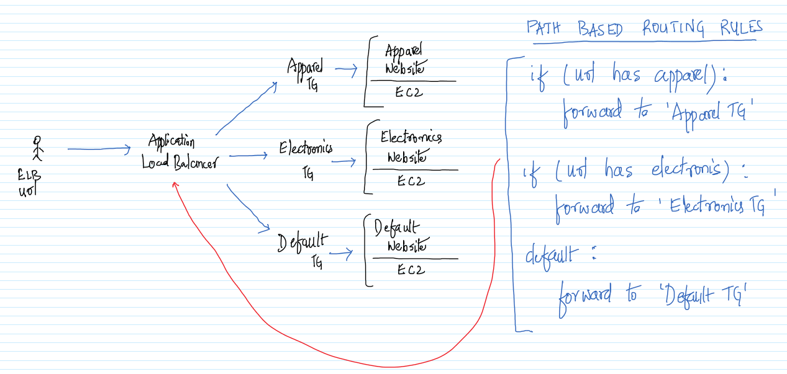

1. Create three EC2 instances from the Launch Template and name them as Apparel, Electronics and Default.\

1. Connect to all the EC2 instances via Putty and execute the below commands
    >sudo su\
    >apt-get update\
    >apt-get install apache2 -y\
    >service apache2 start\
    >cd /var/www/html\
    >rm index.html

1. On the default EC2 instance execute the following command.
    >echo "This is the default website" > index.html

1. On the apparel EC2 instance execute the following commands.
    >mkdir apparel\
    >cd apparel\
    >echo "This is an apparel website" > index.html

1. On the electronics EC2 instance execute the following commands.
    >mkdir electronics
    >cd electronics
    >echo "This is an electronics website" > index.html

1. Make sure that the web pages are accessible using the IP address via the browser.\

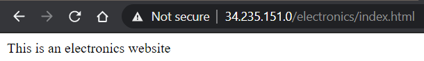

1. In the EC2 Management Console, create three Target Groups (ApparelTG, ElectronicsTG & DefaultTG) with the default options. For each of the above Target Groups add the appropriate EC2 instance as the Target. This can be done by selecting the EC2 instance and clicking on `Include as pending below` button while creating the Target Group.\

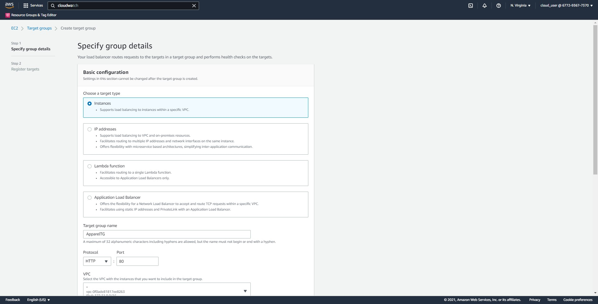
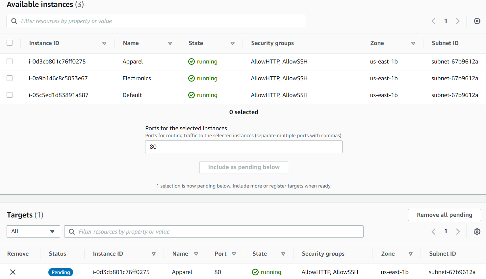

1. Go back to the LoadBalancer Screen and create an Application Load Balancer.\
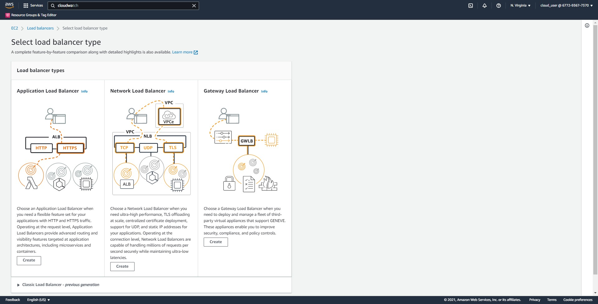

1. Give the Load Balancer a name and make sure to select all the Availability Zones.
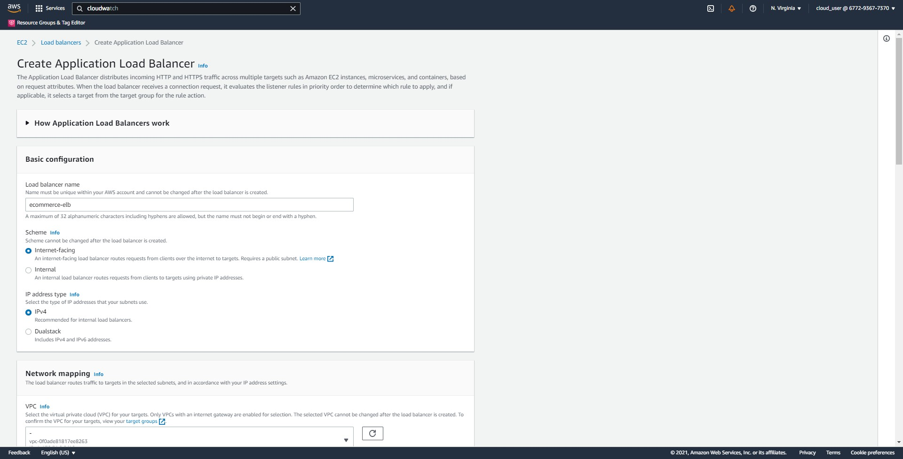
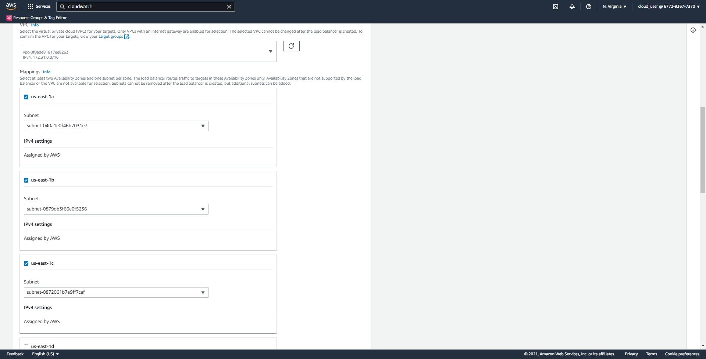

1. Select the `AllowAll` and remove the `default` Security Group.
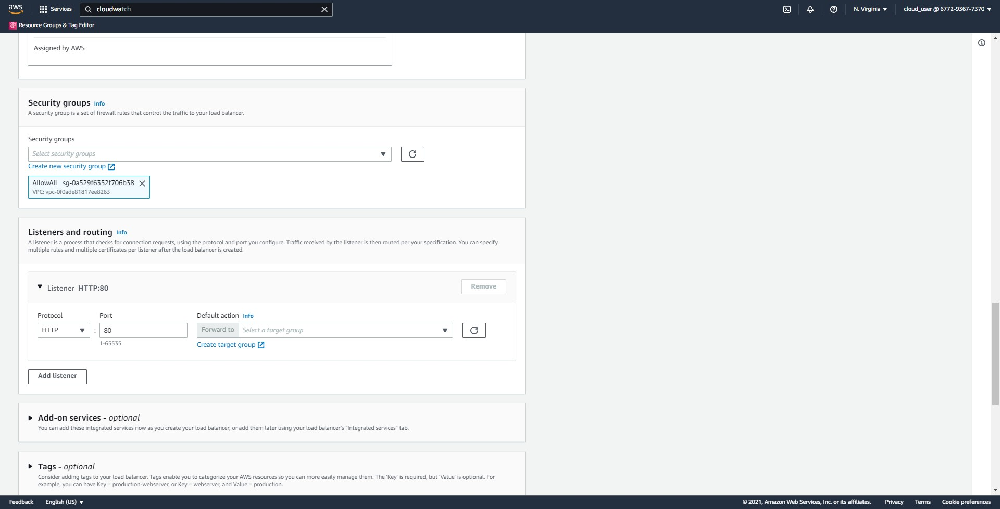

1. Under the `Listeners and routing` select the `DefaultTG`.
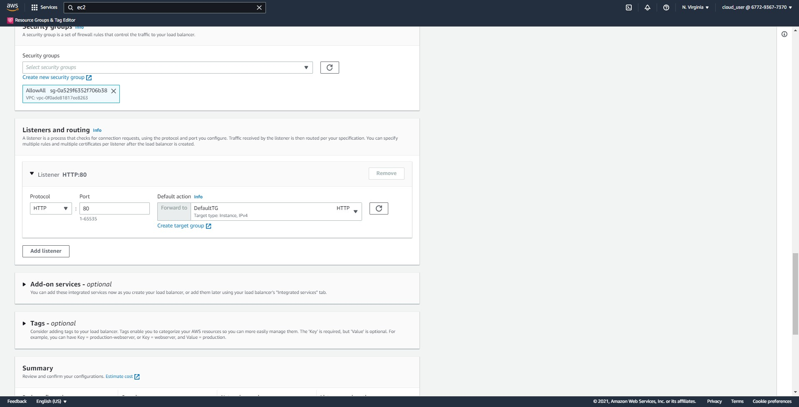

1. Review all the details and click on `Create load balancer`. Initially the `ELB` would be in a `Provisioning` state and in a few minutes it would be turning to `Active` state.
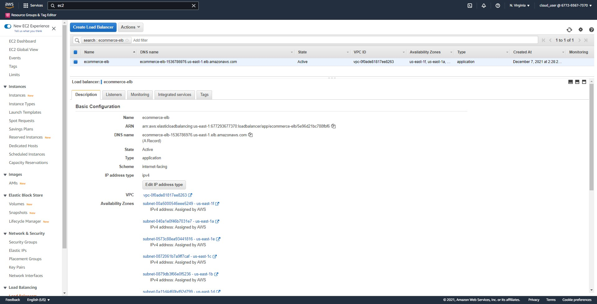

1. Note down the DNS name of the ELB.\

1. In the listeners tab, click on `View/edit rules`.\

1. Click on `plus button` to add a rule and click on `Insert Rule`.\
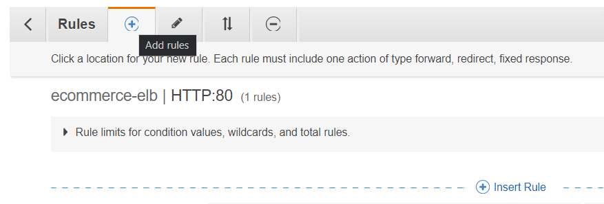

1. Create rules for the electronics and apparel website as shown below.\

1. Visit the pages as shown below and the appropriate web pages should be displayed. If this works then the path based routing works. Make sure to replace the ELB DNS name.\
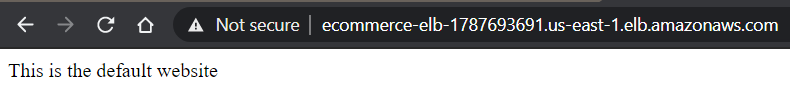
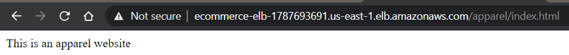
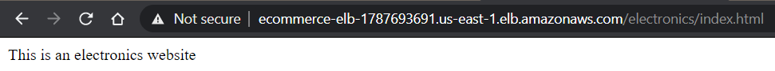

# Further Reading

1. Restricting access to Application Load Balancers
    - https://docs.aws.amazon.com/AmazonCloudFront/latest/DeveloperGuide/restrict-access-to-load-balancer.html

1. How do I attach backend instances with private IP addresses to my internet-facing load balancer in ELB?
    - https://aws.amazon.com/premiumsupport/knowledge-center/public-load-balancer-private-ec2/

1. How ELB routing works?
    - https://docs.aws.amazon.com/elasticloadbalancing/latest/userguide/how-elastic-load-balancing-works.html#request-routing

1. What is ALB?
    - http://docs.aws.amazon.com/elasticloadbalancing/latest/application/introduction.html
    - https://aws.amazon.com/blogs/aws/new-aws-application-load-balancer/

1. Getting started with different ELB
    - https://docs.aws.amazon.com/elasticloadbalancing/latest/userguide/load-balancer-getting-started.html

1. Monitoring the ELB
    - http://docs.aws.amazon.com/elasticloadbalancing/latest/classic/elb-monitor-logs.html

1. ELB Logging
    - https://docs.aws.amazon.com/elasticloadbalancing/latest/classic/access-log-collection.html
    - https://www.thecloudavenue.com/2017/10/creating-application-load-balacer-and-querying-with-athena.html

1. How do I connect a public-facing load balancer to EC2 instances that have private IP addresses?
    - https://aws.amazon.com/premiumsupport/knowledge-center/public-load-balancer-private-ec2/

1. Fine-tuning blue/green deployments on application load balancer
    - https://aws.amazon.com/blogs/devops/blue-green-deployments-with-application-load-balancer/
    - https://www.exampleloadbalancer.net/albwtg_demo.html

1. Application Load Balancers and Classic Load Balancers support X-Forwarded-For, X-Forwarded-Proto, and X-Forwarded-Port headers.
    - https://docs.aws.amazon.com/elasticloadbalancing/latest/userguide/how-elastic-load-balancing-works.html

1. Client IP and ELB Logs
    - https://docs.aws.amazon.com/elasticloadbalancing/latest/classic/access-log-collection.html

1. http to https redirection in ELB?
    - https://aws.amazon.com/about-aws/whats-new/2018/07/elastic-load-balancing-announces-support-for-redirects-and-fixed-responses-for-application-load-balancer/

1. Specific use cases for Private ELB?
    - https://docs.aws.amazon.com/elasticloadbalancing/latest/classic/elb-internal-load-balancers.html

1. Weighted ELB?
    - https://aws.amazon.com/blogs/aws/new-application-load-balancer-simplifies-deployment-with-weighted-target-groups/
    - https://aws.amazon.com/premiumsupport/knowledge-center/elb-make-weighted-target-groups-for-alb/

1. Does ELB works as forward or reverse proxy? Mainly used for load balancing, but can also be used for reverse proxy.
    - https://smartproxy.com/blog/the-difference-between-a-reverse-proxy-and-a-forward-proxy
    - https://www.sumologic.com/blog/aws-elb-vs-nginx-load-balancer/
    - https://www.trianz.com/insights/reverse-proxying-requests-with-aws-elb-edge
    - https://www.nginx.com/resources/glossary/reverse-proxy-vs-load-balancer/

1. Limits of the ELB
    - https://docs.aws.amazon.com/elasticloadbalancing/latest/classic/elb-limits.html
    - https://docs.aws.amazon.com/elasticloadbalancing/latest/application/load-balancer-limits.html
    - https://docs.aws.amazon.com/elasticloadbalancing/latest/network/load-balancer-limits.html

1. ALB Algorithm
    - https://aws.amazon.com/about-aws/whats-new/2019/11/application-load-balancer-now-supports-least-outstanding-requests-algorithm-for-load-balancing-requests/
    - https://docs.aws.amazon.com/elasticloadbalancing/latest/userguide/how-elastic-load-balancing-works.html
    - https://aws.amazon.com/blogs/aws/new-application-load-balancer-simplifies-deployment-with-weighted-target-groups/

1. Lambda functions as targets for Application ELB
    - https://docs.aws.amazon.com/elasticloadbalancing/latest/application/lambda-functions.html