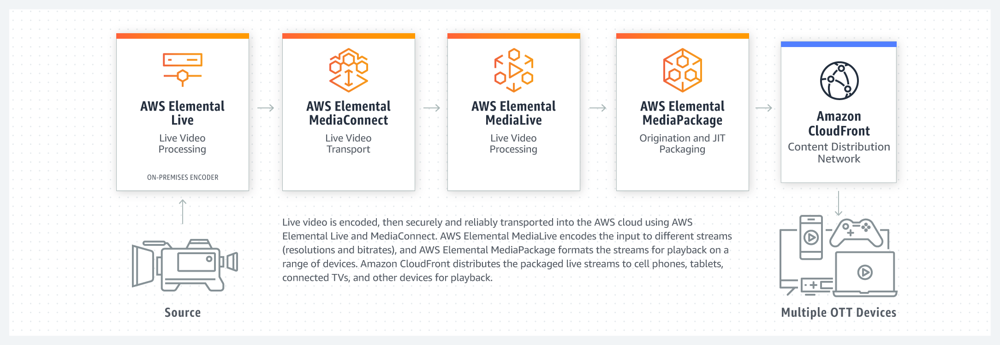
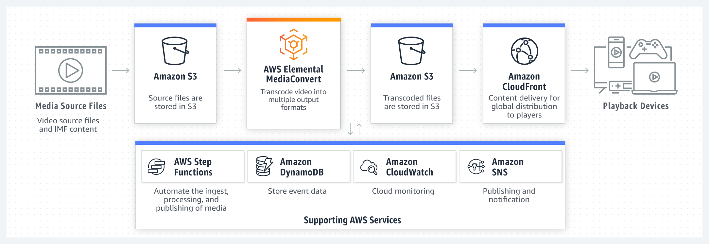
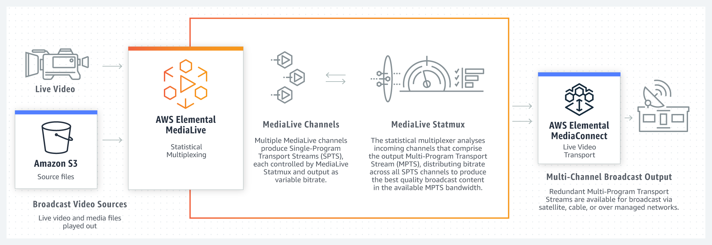

# References

1. Media Services on AWS
    - https://aws.amazon.com/media-services/

1. AWS Elemental
    - https://aws.amazon.com/media-services/elemental/

# In Short

1. Transport

    - MediaConnect - Transport live video reliably and securely to multiple partners and customers. Can create workflows.

1. Encoding

    - Live - Encode live on-premises video for events and 24/7 streams (Software to be deployed anywhere)

    - MediaLive (*) - Encode high-quality live video for broadcast and streaming to any device

    - MediaLive Anywhere - Control live video encoding from the cloud on your own infrastructure

    - MediaConvert (*) - Process video files to prepare high-quality on-demand content for distribution or archive (file based encoding)

1. Packaging

    - MediaPackage (*) - Prepare and protect video, and deliver outstanding viewing experiences (packaging & DRM)

1. Storing

    - MediaStore - Originate and store video assets for live or on-demand media workflows

1. Commercialization

    - MediaTailor - Create and monetize personalized linear channels with dynamic ad insertion

# How They Work Together (Typical Workflows)

1. Live Streaming Workflow

        Camera/Encoder → MediaConnect (transport) → MediaLive (transcode) → MediaPackage (package + DRM) → CloudFront CDN → Users

    

1. Live with Ads Workflow

        Camera/Encoder → MediaConnect (transport) → MediaLive (transcode) → MediaPackage (package + DRM) → MediaTailor (ad insertion) → CloudFront → Users

1. VOD Workflow

    Video File (S3) → MediaConvert (transcode to ABR) → MediaPackage (packaging + DRM) → CloudFront → Users

    

1. Hybrid (Live + VOD Catch-up TV)

    1. Live goes through MediaLive + MediaPackage.

    1. Recordings stored in MediaStore/S3.

    1. Later transcoded by MediaConvert for VOD delivery.

    