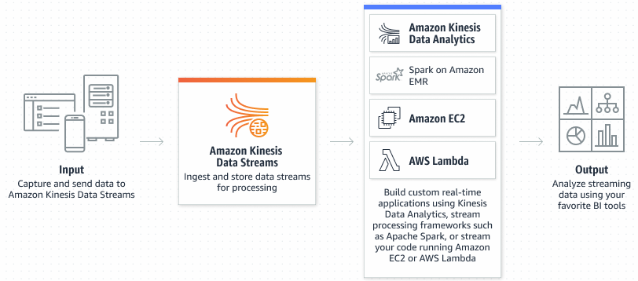
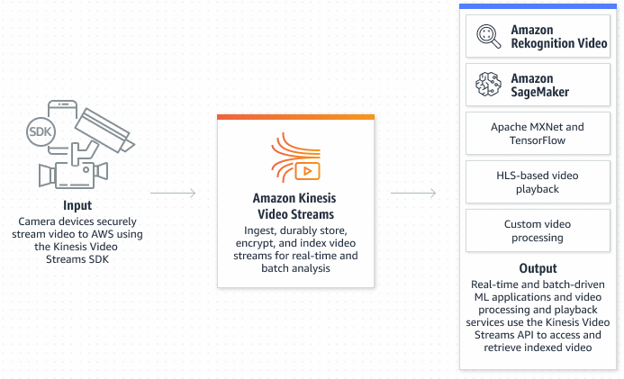

# Kinesis

## Different Services

1. Video Streams and Data Streams
    - https://aws.amazon.com/kinesis/

1. Amazon Data Firehose
    - https://aws.amazon.com/firehose/

1. What is Amazon Kinesis Data Analytics for SQL Applications?
    - https://docs.aws.amazon.com/kinesisanalytics/latest/dev/what-is.html

## Further Reading

1. Write data to Amazon Kinesis Data Streams (including Apache Flink)
    - https://docs.aws.amazon.com/streams/latest/dev/building-producers.html

1. Read data from Amazon Kinesis Data Streams (including Apache Flink)
    - https://docs.aws.amazon.com/streams/latest/dev/building-consumers.html
