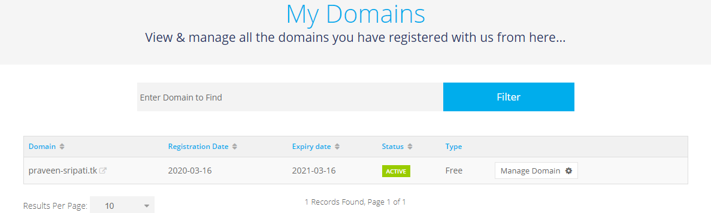
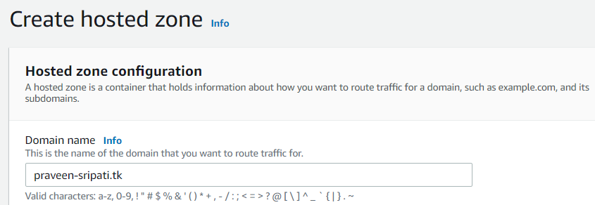
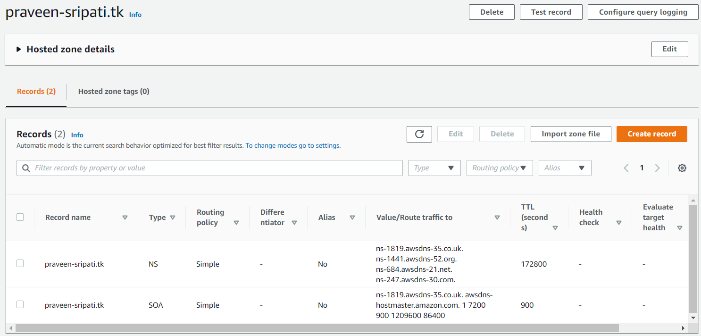
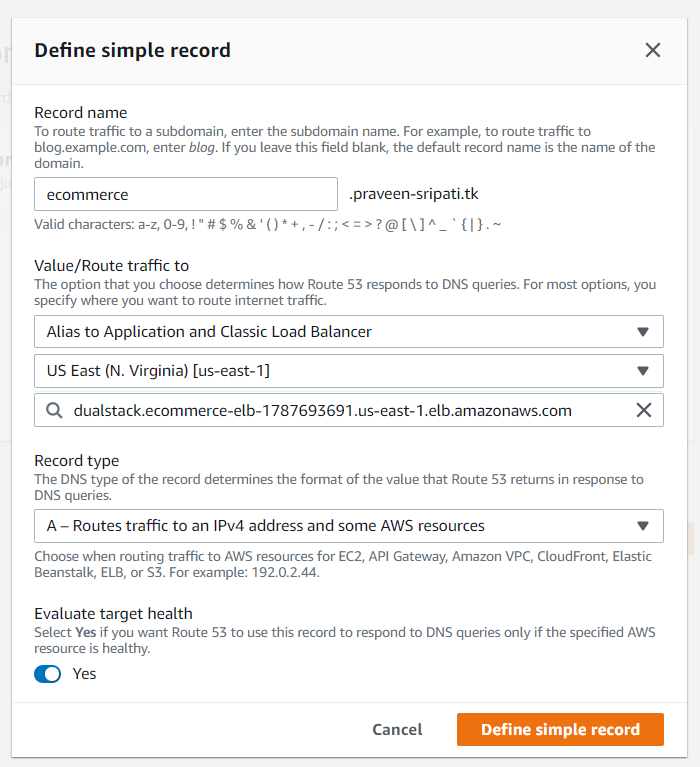
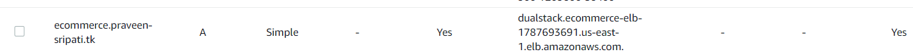
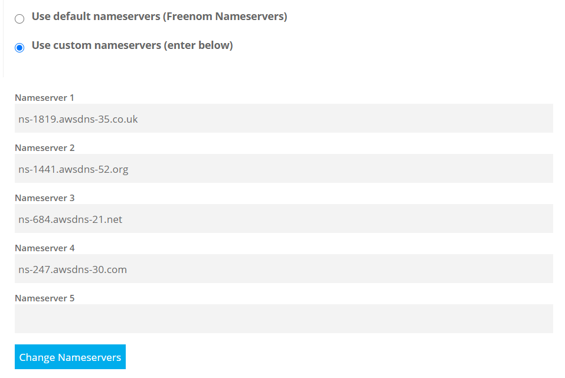
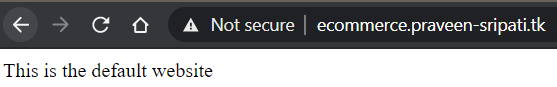
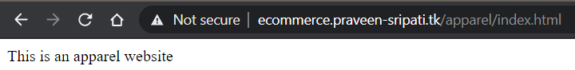
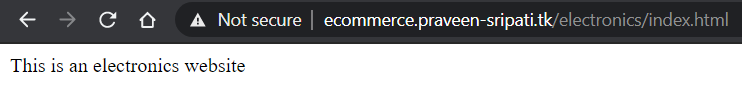

# Access the webpages on the EC2 using user friendly name and not the IP address

1. Create an EC2 instance (Windows or Linux) and setup a website. Note down the Public IP address of the EC2.

1. Navigate to freenom.com.

1. Enter a domain name and check for the availability.

1. Click on `Get it now!` for a domain of your choice.

1. Click on `Checkout`.

1. Select `12 Months @ FREE` in the Period and click on `Continue`.

1. Enter your email and click on `Verify my Email address`.

1. A verification email will be sent. Click on the link in the email to confirm the email.

1. Enter `Your Details`, agree the T&C and click on `Complete Order` to register the domain.

1. In Freenom under `Services -> My Domains` the domain which has been registered earlier should appear as shown below.\

## Create a Route53 Hosted Zone with Records

1. In the Route53 Management Console, go to `Hosted zones` and click on `Created hosted zone`.

1. Enter the `Domain name` created in Freenom and click on `Create hosted zone`.\

1. A hosted zone would be created as shown below. Note down the four name servers.\

1. Click on `Create record`.

1. Select `Simple routing` and click on Next.

1. Click on `Define simple record`.

1. Define the record details as shown below. Click on `Define simple record`. Make sure to use the Public IP address of the EC2. Click on `Create records`.\

1. A record would be created as shown below in the hosted zone.\

## Update the DNS Records in Freenom for the registered domain

1. Navigate to the below URL and click on `Manage Domain`.
https://my.freenom.com/clientarea.php?action=domains

1. Click on `Management Tools -> Nameservers`.

1. Select `Use custom nameservers (enter below)`, enter the Name Servers got from the Hosted Zone one-by-one and click on `Change Nameservers`.\

## Test the user friendly name for ELB and test path based routing

1. As shown below not the ELB has a user friendly name.\  

# Further Reading

1. Registering a new domain with Route53
    - https://docs.aws.amazon.com/Route53/latest/DeveloperGuide/domain-register.html

1. Listener rules for your Application Load Balancer
    - https://docs.aws.amazon.com/elasticloadbalancing/latest/application/listener-update-rules.html

1. Route53 Routing Policies
    - https://docs.aws.amazon.com/Route53/latest/DeveloperGuide/routing-policy.html

1. I changed DNS settings, but they haven't taken effect
    - https://docs.aws.amazon.com/Route53/latest/DeveloperGuide/troubleshooting-new-dns-settings-not-in-effect.html

1. How the Domain Name System (DNS) Works
    - https://www.verisign.com/en_IN/website-presence/online/how-dns-works/index.xhtml

1. Logging in Route53
    - https://docs.aws.amazon.com/Route53/latest/DeveloperGuide/logging-monitoring.html
    - https://docs.aws.amazon.com/Route53/latest/DeveloperGuide/query-logs.html

1. Route53 Routing Policies
    - https://docs.aws.amazon.com/Route53/latest/DeveloperGuide/routing-policy.html

1. I changed DNS settings, but they haven't taken effect
    - https://docs.aws.amazon.com/Route53/latest/DeveloperGuide/troubleshooting-new-dns-settings-not-in-effect.html

1. Using VPC Endpoints in Multi-Region Architectures with Route 53 Resolver
    - https://aws.amazon.com/blogs/architecture/using-vpc-endpoints-in-multi-region-architectures-with-route-53-resolver/