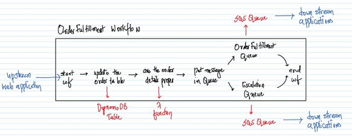
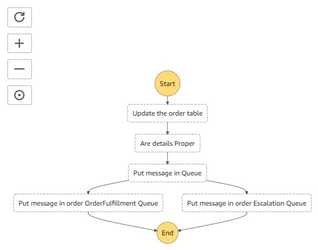

# StepFunctions

## Order fulfillment workflow

## Steps for implementing the above workflow

1. Create a table in DynamoDB, name as `OrderTable` and the `PartitionKey` as `OrderId/String`.

1. Create a SQS Queue `OrderFulfillmentQueue`. Note down the URL of the Queue.

1. Create another SQS Queue `EscalationQueue`. Note down the URL of the Queue.

1. Create an IAM Role `RoleForLambda` for Lambda with `AWSLambdaBasicExecutionRole` policy.

1. Create a Lambda `VerifyCCAndPrice` in Python 2.7 and attach the above IAM Role and the code from lambda.py.

1. Create an IAM Role `Role4OrderFulfillmentStepFunctions` for StepFunctions with the default policy.

1. Attach the below IAM Policies to the above IAM Role.
	- AmazonSQSFullAccess
	- AmazonDynamoDBFullAccess
	- AWSLambdaRole

1. Goto to StepFunctions Console and create a `State Machine` with the default options.

1. Paste the `order-fulfillment.json` in the definition. Click on the refresh button and notice the workflow on the right pane getting updated.

1. Make sure to replace the Lambda ARN and SQS URL for both the Queues in the JSON code. Click on Next.

1. Give the `State Machine` a name `OrderFulfillmentStateMachine`.

1. Select the IAM Role created earlier for the `State Machine`.

1. Go with the rest of the default options and click on `Create state machine`.

1. Click on `Start execution` and enter a valid/invalid JSON and again click on `Start execution`.

1. Notice
    - Execution path in the workflow.
    - A new item in the DynamoDB Table.
    - A new message in the SQS Queue. 

# Further Reading

1. Step Functions Distributed Map – A Serverless Solution for Large-Scale Parallel Data Processing
    - https://aws.amazon.com/blogs/aws/step-functions-distributed-map-a-serverless-solution-for-large-scale-parallel-data-processing/

1. AWS Step Functions Workflow Studio – A Low-Code Visual Tool for Building State Machines
    - https://aws.amazon.com/blogs/aws/new-aws-step-functions-workflow-studio-a-low-code-visual-tool-for-building-state-machines/

1. Creating a Lambda State Machine
    - https://docs.aws.amazon.com/step-functions/latest/dg/tutorial-creating-lambda-state-machine.html

1. How StepFunctions Work?
    - https://docs.aws.amazon.com/step-functions/latest/dg/how-step-functions-works.html

1. Tutorials and sample projects
    - https://docs.aws.amazon.com/step-functions/latest/dg/tutorials.html
    - https://docs.aws.amazon.com/step-functions/latest/dg/create-sample-projects.html
    - https://aws.amazon.com/getting-started/hands-on/create-a-serverless-workflow-step-functions-lambda/
    - https://aws.amazon.com/getting-started/hands-on/handle-serverless-application-errors-step-functions-lambda/
    - https://aws.amazon.com/getting-started/hands-on/scheduling-a-serverless-workflow-step-functions-cloudwatch-events/
    - https://medium.com/weareservian/serverless-data-processing-with-aws-step-functions-an-example-6876e9bea4c0
    - https://docs.aws.amazon.com/solutions/latest/video-on-demand/welcome.html

1. Step Functions vs GCP Workflows
    - https://www.tbray.org/ongoing/When/202x/2020/09/21/AWS-Step-Functions-vs-GCP-Workflows